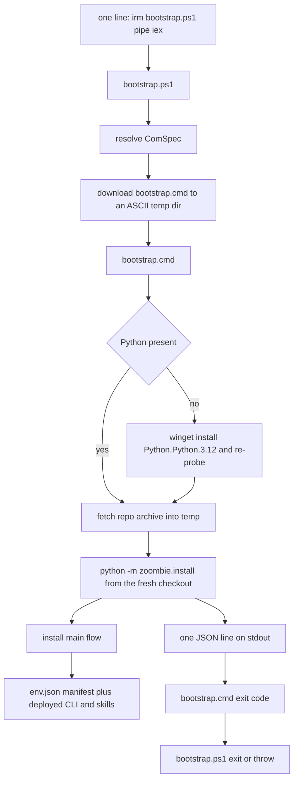

# Plan: a PowerShell setup entry point — one line from anywhere

## Goal

Make distribution of the toolchain a **single PowerShell line** that works from any
shell, any working directory, on a machine with nothing installed:

```powershell
irm https://raw.githubusercontent.com/carnivorum/zoombie/main/scripts/bootstrap.ps1 | iex
```

`scripts/bootstrap.ps1` is new. It is a **shim, not a second installer**: it exists
only so a PowerShell user never has to fetch, save and then invoke a `.cmd`. All
install logic stays where it already is — [`scripts/bootstrap.cmd`](scripts/bootstrap.cmd:1)
ensures Python and fetches the repo, [`scripts/zoombie/install/main.py`](scripts/zoombie/install/main.py:47)
does the work.

## What exists today

| Piece | State | Notes |
|-------|-------|-------|
| [`scripts/bootstrap.cmd`](scripts/bootstrap.cmd:1) | the only entry point | finds or installs Python, downloads the repo archive into `%TEMP%\zoombie-bootstrap-<rnd>`, runs `python -m zoombie.install`, cleans up |
| [`scripts/zoombie/install/main.py`](scripts/zoombie/install/main.py:47) | install/update | `-Check`, `-DryRun`, `-Model`, `-Root`, `-Force`; one JSON line on stdout |
| [`scripts/zoombie/install/update.py`](scripts/zoombie/install/update.py:68) | **dead code** | re-implements bootstrap.cmd's fetch-and-run in Python; nothing references it (verified by search) |
| `scripts/*.ps1`, `scripts/lib/ZoombieEnv.psm1` | absent from the tree | the pre-Port PowerShell implementation; still open in editor tabs and still referenced by plans only |
| [`setup.md`](setup.md:119) / [`README.md`](README.md:175) | docs | Step 0 is a PowerShell snippet that downloads `bootstrap.cmd` into `%USERPROFILE%\zoombie-env\src` by hand |

So the gap is purely ergonomic: a PowerShell user must currently issue a `curl`/`irm`
download, then run a batch file. The batch file is already cwd-independent, so no
install logic needs to move.

## Architecture after the change



There is exactly one implementation of the fetch step. `bootstrap.ps1` adds no
install knowledge, so it cannot drift from `bootstrap.cmd`.

## Decision points

Recommendations are stated so implementation can proceed unless the user disagrees.

### D1. Shim versus reimplementation — recommend: shim

`bootstrap.ps1` downloads `bootstrap.cmd` to a temp dir and runs it through
`$env:ComSpec`. Reimplementing the archive fetch in PowerShell would duplicate
`bootstrap.cmd`'s Python discovery, staging and cleanup, and the duplication would
be invisible until the two diverge. A shim is also ~60 auditable lines.

### D2. Parameter passing under `iex` — recommend: switches plus env fallback

`irm ... | iex` cannot bind script parameters, so a `param()` block alone is not
enough. Design both:

- `param([switch]$Check, [switch]$DryRun, [string]$Model, [string]$Root, [switch]$Force, [switch]$Yes)`
  so `& {\iex-style block} -Check` and a saved `.\bootstrap.ps1 -Check` both work;
- `$env:ZOOMBIE_*` overrides (`ZOOMBIE_CHECK`, `ZOOMBIE_DRYRUN`, `ZOOMBIE_MODEL`,
  `ZOOMBIE_ROOT`, `ZOOMBIE_FORCE`, `ZOOMBIE_YES`, plus the existing
  `ZOOMBIE_REPO_SLUG` / `ZOOMBIE_REPO_REF`) for the true one-liner form.

Precedence: an explicit switch wins, then the env var, then the default. One
resolver function translates the merged set into the argv handed to `bootstrap.cmd`.

### D3. Confirmation gate — DECIDED: none in the script

The original recommendation was a `Read-Host` prompt unless `-Yes` was passed.
**Rejected by the user**: the one-liner must run unattended, and asking the user is
the setup prompt's job (`setup.md` hard rule 3), not the script's. So
`bootstrap.ps1` never prompts and has no `-Yes` parameter. It prints what it is
about to do, then does it; the agent driving `setup.md` is what describes the
download and waits for the user before invoking the real run.

### D4. The canonical one-liner — recommend: verify both forms on a clean VM

`irm` is `Invoke-WebRequest`, which on Windows PowerShell 5.1 uses the IE parsing
engine unless `-UseBasicParsing` is passed; on a machine where IE has never been
run that fails with a confusing error, and `-UseBasicParsing` is deprecated on
PowerShell 7. The two candidate lines are:

- `irm <url> | iex` — shortest, and the headline in the docs;
- `iex (New-Object Net.WebClient).DownloadString(<url>)` — no IE dependency, no
  progress bar, works on 5.1 and 7.

Pick one after running it on a clean Windows 10/11 VM, and document only the
verified form, with the other as a troubleshooting note. Recording the symptom
("The response content cannot be parsed") next to the fix is what makes the
one-liner safe to hand to a colleague.

### D5. Failure propagation under `iex` — recommend: never `exit`, throw instead

`iex` runs in the **caller's** session, so an `exit` inside the script closes the
user's shell. When the script runs as a file (`$PSScriptRoot` non-empty) it should
`exit $code`; when it is inline (`$PSScriptRoot` empty, the `iex` case) it must
`throw` a terminating error on failure and otherwise leave `$LASTEXITCODE` set.
This distinction is the single most important detail of the shim.

### D6. Dead `update.py` — recommend: delete it

Once `bootstrap.ps1` delegates to `bootstrap.cmd`, [`update.py`](scripts/zoombie/install/update.py:1)
is a third unreferenced implementation of the same thing. It also cannot serve the
"no Python yet" case, which is precisely why `bootstrap.cmd` exists. Delete it and
correct the references in [`README.md`](README.md:91) and
[`setup.md`](setup.md:32), or keep it only with a test that proves it is called.

## bootstrap.ps1 contract

Hardening items, each an explicit line of the implementation:

1. **No file-location dependency.** No `$PSScriptRoot`, no `$MyInvocation.MyCommand.Path`,
   no relative paths. Everything resolves from `$env:TEMP` / `$env:PUBLIC` and the
   embedded URL, so the inline form behaves identically to the saved form.
2. **One implementation of the fetch.** Download
   `https://raw.githubusercontent.com/<slug>/<ref>/scripts/bootstrap.cmd`, honouring
   `ZOOMBIE_REPO_SLUG` / `ZOOMBIE_REPO_REF`, using the same default slug and ref as
   [`bootstrap.cmd`](scripts/bootstrap.cmd:16).
3. **ASCII staging.** When `%USERPROFILE%` is not ASCII, `%TEMP%` is not either, so
   the shim places `bootstrap.cmd` in `%PUBLIC%\zoombie-bootstrap` instead. This
   matches the root-selection rule in [`paths.env_root()`](scripts/zoombie/lib/paths.py:95).
4. **Resolve cmd through `$env:ComSpec`** (falling back to
   `$env:SystemRoot\System32\cmd.exe`), never by trusting PATH.
5. **`$ProgressPreference = 'SilentlyContinue'`** around its own fetch —
   `Invoke-WebRequest`'s progress bar is a large, measurable slowdown on PS 5.1.
   Restore the previous value afterwards rather than leaving a global changed.
6. **UTF-8 output.** Set `$env:PYTHONUTF8=1` and `$env:PYTHONIOENCODING=utf-8` for
   the child, and set `[Console]::OutputEncoding` only if it is not already UTF-8.
   Do not run `chcp`, which mutates the user's console.
7. **Stream separation.** The installer's single JSON line is the caller's machine
   result; the shim must not print extra lines to stdout. Everything the shim itself
   says goes to stderr (`Write-Host` is fine for a terminal UX, but the JSON line
   must remain the only stdout content).
8. **Exit codes.** `$LASTEXITCODE` from `bootstrap.cmd` is the shim's result: `0`
   success, non-zero failure. A child that never started is a failure, not a silent
   success — never leave `$LASTEXITCODE` undefined.
9. **Cleanup.** Remove the staged `bootstrap.cmd` in a `finally`, so a failed run
   leaves nothing behind; keep it only when a debug switch is set.
10. **Nothing global is mutated.** No `Set-ExecutionPolicy`, no `setx`, no
    `$PROFILE` edit, no permanent PATH change, no dot-sourcing of the repo's
    modules. The shim's only persistent effect is what the installer decides.
11. **Idempotence unchanged.** Re-running the same line re-fetches the latest repo
    and updates in place, exactly as `bootstrap.cmd` does today. There is no cached
    copy and no gate that can skip the update.
12. **PowerShell 5.1 syntax only.** No ternary, no `??`, no `-Parallel`, nothing
    that requires `pwsh`. Target Windows PowerShell 5.1 first, PowerShell 7 second.
13. **Actionable failures.** A failed fetch names the URL, the slug and ref, the
    override variables, and the `-UseBasicParsing` / `WebClient` alternative. A
    failed `cmd` launch says what to run by hand instead.
14. **`-Help` / comment-based help.** The header comments carry the usage, the
    options, the env overrides and the one-liner, so the file is self-documenting.

## Docs

- [`setup.md`](setup.md:119) — replace Step 0.1's two download snippets with the
  verified one-liner as the primary path, keep the `curl.exe`/`Invoke-WebRequest`
  form as the explicit cmd.exe fallback, and state that no `Unblock-File` or
  execution-policy change is needed because nothing is saved to disk.
- [`setup.md`](setup.md:146) §0.2 — the "why a batch file" paragraph becomes "both
  entry points exist; the PowerShell one is a shim over the batch one", keeping the
  claim that no `.ps1` needs unblocking only for the **downloaded** script.
- [`README.md`](README.md:175) — "Distributing to other machines" gains the
  one-liner beside the existing `curl` sentence, and the `update.py` row in the
  layout table is corrected or removed per D6.
- [`README.md`](README.md:56) layout block — add `bootstrap.ps1` with a one-line
  description.
- The six `SKILL.md` files say "Run `scripts\bootstrap.cmd` first" (for example
  [`zoombie-transcribe-audio/SKILL.md`](skills/zoombie-transcribe-audio/SKILL.md:56)).
  Update the wording to name the bootstrap generically, and **bump `SKILL_VERSION`**
  in [`scripts/zoombie/__init__.py`](scripts/zoombie/__init__.py:23) so deployment
  reports the installed skills as `updated` rather than `up to date`.
- [`plans/zoombie-python-conversion.md`](plans/zoombie-python-conversion.md:209)
  describes "ONE bootstrap: ensure Python, fetch repo, hand off". Append a decision
  note that the PowerShell entry is a shim over it, so the plan does not read as
  contradicted.

## Tests

Add repo-level invariants in the style of [`tests/test_skills.py`](tests/test_skills.py:1)
— pytest, no network, no PowerShell execution:

1. **[`tests/test_bootstrap.py`](tests/) — agreement.** `bootstrap.ps1` and
   `bootstrap.cmd` embed the same default repo slug and ref, and advertise the same
   option set (`-Check`, `-DryRun`, `-Model`, `-Root`, `-Force`).
2. **Safety.** The script text contains no `Set-ExecutionPolicy`, no `setx`, no
   `$PROFILE`, and no top-level `exit` outside the file-mode branch.
3. **Location independence.** The text contains no `$PSScriptRoot` and no
   `$MyInvocation` used for path resolution.
4. **ASCII staging.** The staging-directory expression references `PUBLIC` as the
   non-ASCII fallback.
5. **Docs consistency.** Every path referenced as an entry point by
   [`README.md`](README.md:1) and [`setup.md`](setup.md:1) exists on disk; this is
   the same class of check that caught the missing `zoombie-summarize` skill.
6. **No dangling references.** No file in the repo references
   [`scripts/setup-worker.ps1`](scripts/setup-worker.ps1:1),
   [`scripts/zoombie.ps1`](scripts/zoombie.ps1:1) or
   [`scripts/lib/ZoombieEnv.psm1`](scripts/lib/ZoombieEnv.psm1:1) as a live path —
   plans may mention them only as history. This closes the "open editor tabs" gap
   that caused the ambiguity in the first place.

## Verification

Manual, because the point of the change is distribution:

1. On a clean Windows 10/11 VM with no Python, run the chosen one-liner from
   `C:\` (not from a checkout) in Windows PowerShell 5.1 and confirm a full install.
2. Re-run the exact same line and confirm it updates in place and reports the same
   JSON shape.
3. Re-run with `-Check` semantics through the env override and confirm nothing is
   written.
4. Confirm the JSON result line is the only stdout output, and that progress is on
   stderr.
5. Confirm no `exit` closes the caller's session on the failure paths, including an
   offline fetch and a non-zero installer exit.
6. Repeat on a Cyrillic user profile (`C:\Users\<cyrillic>`) and confirm the ASCII
   root is used and the staged `bootstrap.cmd` lands under `%PUBLIC%`.
7. Run `python -m pytest tests` and `python -m zoombie.selftest` on a configured
   machine and confirm no regression.

## Implemented (2026-09-20)

`scripts/bootstrap.ps1` exists as described, with D3 decided as *no prompt* and D6
decided as *delete `update.py`* (done). `tests/test_bootstrap.py` adds 17 invariants
over the two entry points. Verified on this machine:

- file mode: `powershell -NoProfile -ExecutionPolicy Bypass -File scripts\bootstrap.ps1 -Check`
  fetched the published batch file, ran the installer in CHECK mode, and returned
  exit code 0 with one JSON line on stdout;
- inline mode: piping the script into `iex` with `ZOOMBIE_DRYRUN=1` completed and
  left the caller's session alive, with `$LASTEXITCODE` set to 0;
- failure in inline mode: a deliberately bad `ZOOMBIE_REPO_SLUG` produced a
  terminating **throw** naming the URL and the override variables — the shell
  survived instead of being closed;
- `python -m pytest tests` → 384 passed; PowerShell parser reports no syntax error;
- `python -m zoombie.selftest` → PASS, including the Cyrillic-path and CUDA
  regressions.

Still unverified, because it needs a host with no Python and a non-ASCII profile:
the clean-VM install (D4's choice of `irm ... | iex` vs `WebClient`) and the
`%PUBLIC%` staging path. Both are itemised in the todo list and are the reason D4
remains open.

## Risks

| Risk | Handling |
|------|----------|
| The one-liner looks like a "curl pipe to shell" pattern and may be refused by a cautious user or a policy scanner | The shim is short, auditable, and does nothing but download one GitHub-raw file and run the existing batch entry point; the docs state that and link both files |
| `iex` runs in the caller's session, so a stray `exit` closes their shell | D5: `exit` only in file mode, `throw` inline, `$LASTEXITCODE` always set |
| `irm` fails on a machine where IE has never run | D4: verify the canonical form on a clean VM and document the symptom and the alternative |
| A PowerShell shim drifts from the batch entry point | D1 plus the agreement test in `tests/test_bootstrap.py` |
| `SKILL.md` wording changes without a version bump leave deployed skills stale | Bump `SKILL_VERSION` in [`scripts/zoombie/__init__.py`](scripts/zoombie/__init__.py:23) in the same change |
| Removing [`update.py`](scripts/zoombie/install/update.py:1) breaks a caller not visible in this repo | The change is gated on D6; the search in this plan found no in-repo caller |
