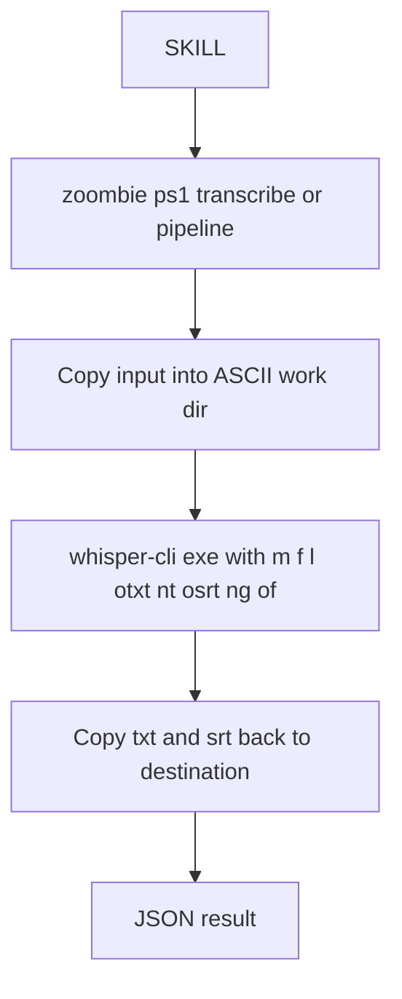
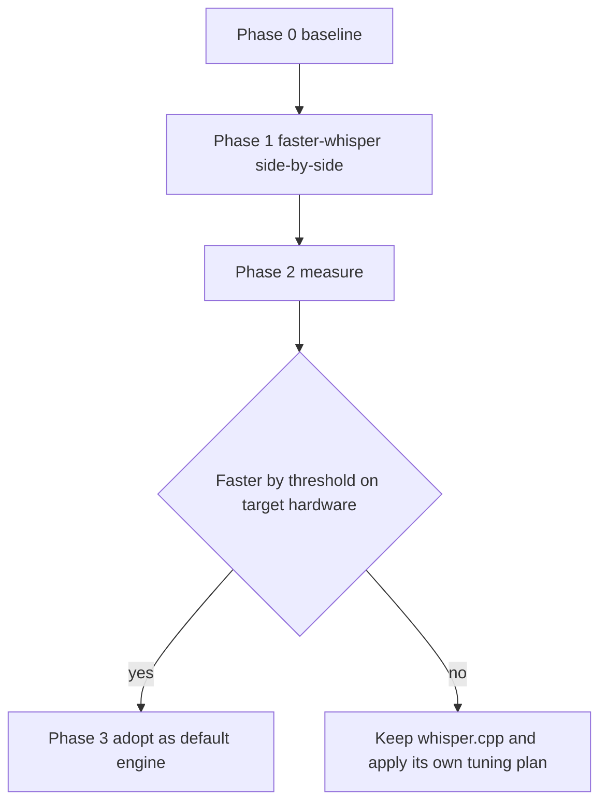

# Plan: evaluate replacing whisper.cpp with faster-whisper (CTranslate2)

## Goal

Decide, on measured evidence rather than on reputation, whether the
transcription engine should move from **whisper.cpp** (`whisper-cli.exe`) to
**faster-whisper** on CTranslate2, accepting a second engine and a Python
speech-to-text dependency.

## The claim that must not be misread

faster-whisper's headline figure — *"up to 4x faster than openai/whisper with
the same accuracy"* — compares CTranslate2 against the **original OpenAI Python
reference implementation**, which is the slowest of the three. It does **not**
compare against whisper.cpp.

whisper.cpp is itself a heavily optimized C/C++ runtime with CUDA, Vulkan and
Metal backends plus flash attention. On GPU the two are frequently in the same
ballpark, and on some devices whisper.cpp is faster. The genuine, structural
advantages of faster-whisper are elsewhere:

| Advantage | Detail |
|-----------|--------|
| int8 quantization on CPU | Large CPU speedup; the single biggest win over whisper.cpp's default f16 CPU path |
| Integrated Silero VAD | Built into the library; removes silent regions before decoding |
| Batched inference | `BatchedInferencePipeline` raises throughput across long files and batches |
| Word-level timestamps | Better SRT/subtitle output |
| No whisper.cpp Cyrillic-path bug | Pure Python file handling, so the ASCII-path workaround is no longer needed for STT |

And its costs are equally concrete:

| Cost | Detail |
|------|--------|
| CUDA runtime coupling | CTranslate2 CUDA builds need a matching cuBLAS **and** cuDNN version; on Windows this is a recurring source of DLL pain, and the exact cuDNN major version must be confirmed for the installed CTranslate2 build at implementation time |
| Heavier dependency tree | `faster-whisper` pulls `ctranslate2`, `tokenizers`, `huggingface-hub`, `onnxruntime`, `av` (PyAV, bundled FFmpeg), `numpy` |
| Python becomes mandatory | Today Python is a *soft* dependency for transcription (setup logs it as optional). Adopting faster-whisper makes it a **hard requirement for the core feature** |
| Different model format | CT2 model *directories* (`model.bin`, `config.json`, `tokenizer.json`) instead of a single `ggml-*.bin` file — changes download, resume and integrity logic |
| Loses the GGML toolchain | The `GGML_*` / `-fa` / `-t` tuning surface is discarded; CT2 exposes different knobs (`compute_type`, `cpu_threads`, `beam_size`, `vad_filter`) |

**Therefore: this decision is empirical and must be measured on the target
machine.** No plan should adopt faster-whisper on the strength of a quoted
multiple.

## Where the engine sits today

Replacing the engine touches exactly one function plus the installer:
[`Invoke-WhisperOnSafeCopy()`](scripts/zoombie.ps1:332) and
[`Install-Whisper()`](scripts/setup-worker.ps1:494) /
[`Install-WhisperModel()`](scripts/setup-worker.ps1:555). Everything else — the
skills, the JSON contract, the destination handling, `readpdf` — is untouched.

## Design position: one engine, not two

A permanent dual-engine arrangement doubles the install surface, the test
matrix and the failure modes, and this repo's whole thesis is determinism and a
single tested path. So:

- Keep **one** default engine.
- Add an `-Engine whispercpp|fasterwhisper` parameter only as a **transition
  and debugging affordance**, not as a supported dual runtime.
- If faster-whisper wins on the target hardware, make it the default and keep
  the whisper.cpp code path for a deprecation window, then remove it.

The CLI's JSON result contract stays stable; a new `engine` field is added to
`data` so callers can tell which ran.

## Decision criteria (set before measuring)

Adopt faster-whisper as the default only if a measured comparison on the target
machine shows at least one of:

1. **GPU:** faster-whisper RTF is better by a meaningful margin at equal model
   size and equal accuracy on the same audio — set the threshold in advance,
   e.g. **>= 1.3x**, so the result cannot be rationalized after the fact.
2. **CPU-only machines:** a clear win from int8 (this is the most likely and
   most defensible adoption case).
3. **Long/real recordings:** a clear win from VAD plus batching, measured on a
   recording that actually contains silence, not on the synthetic pangram.

Keep whisper.cpp if the two are within noise on GPU, or if accuracy regresses
on the sample, or if the cuDNN coupling proves unreliable to install.

Accuracy must be checked, not assumed: diff the two transcripts on the same
sample file and count word-level disagreements. VAD filtering and int8 both
carry a small accuracy risk on hard audio.

## Spike procedure

### Phase 0 — instrument and baseline whisper.cpp

- Instrument the existing engine first (this is items B1/B6 of
  [`plans/zoombie-transcription-performance.md`](plans/zoombie-transcription-performance.md)):
  capture whisper stderr instead of discarding it at
  [`zoombie.ps1:402`](scripts/zoombie.ps1:402), and report `deviceUsed`,
  `loadMs`, `totalMs` and `realtimeFactor`.
- Record the baseline on **real** audio: a 10-30 minute recording with speech
  and silence, on both the GPU and with `-ng`.
- Without this step there is nothing to compare against, and the existing code
  cannot even tell you whether the GPU was used.

### Phase 1 — faster-whisper side by side, outside the repo

- Create an isolated venv (not the repo's shared interpreter yet) and install
  `faster-whisper` plus the CUDA runtime wheels.
- Confirm the CUDA path actually engages at the CTranslate2 level before
  benchmarking; a silent CPU path here would invalidate the comparison exactly
  as it does today.
- Run the same audio, the same model size, at `float16` on GPU and `int8` on
  CPU.
- Also test a long-silence recording with and without `vad_filter=True`.

### Phase 2 — measure and compare

| Metric | whisper.cpp baseline | faster-whisper | Verdict |
|--------|----------------------|----------------|---------|
| RTF on GPU, real audio | | | |
| RTF on CPU, real audio | | | |
| Wall time on silence-heavy audio | | | |
| VRAM or RAM peak | | | |
| Install time and failure modes | | | |
| Word-level accuracy diff | | | |

### Phase 3 — adopt, only if the numbers justify it

## Changes by file, if faster-whisper is adopted

### New

1. `scripts/stt/transcribe_fastwhisper.py` — the deterministic Python engine
   wrapper, mirroring the role of
   [`scripts/pdf/extract_pdf.py`](scripts/pdf/extract_pdf.py): takes
   `--input`, `--output-base`, `--model`, `--language`, `--compute-type`,
   `--device`, `--threads`, `--vad/--no-vad`, `--srt`, `--json`, and emits one
   JSON line. It owns TXT and SRT writing, so the output format stays
   byte-comparable with the whisper.cpp path.
2. `scripts/requirements-stt.txt` — pinned `faster-whisper` plus the CUDA
   runtime pins, kept separate from
   [`scripts/requirements-pdf.txt`](scripts/requirements-pdf.txt) so the PDF and
   STT dependency sets can fail independently.

### Modified

3. [`scripts/zoombie.ps1`](scripts/zoombie.ps1)
   - Refactor [`Invoke-WhisperOnSafeCopy()`](scripts/zoombie.ps1:332) to
     dispatch on engine, keeping the ASCII isolation, the artifact copy-back,
     `-DryRun`/`-Force` handling and the JSON shape identical.
   - Add `-Engine`, `-ComputeType`, `-Threads` and `-NoVad` parameters.
   - Add `engine`, `deviceUsed`, `modelName` and `realtimeFactor` to `data`.
   - The GPU-retry-on-failure logic at
     [`zoombie.ps1:405`](scripts/zoombie.ps1:405) must be reimplemented for the
     Python engine, since its failure signature differs.
4. [`scripts/setup-worker.ps1`](scripts/setup-worker.ps1)
   - New `Install-FasterWhisperEngine`, modelled on
     [`Install-PdfToolchain()`](scripts/setup-worker.ps1:622): `pip install
     --user -r requirements-stt.txt`, verify imports, reuse the
     [`Get-ZoombiePipShimSnapshot()`](scripts/lib/ZoombieEnv.psm1:329) shim
     cleanup, and honour `-Check`/`-DryRun`/`-Force`.
   - Replace the single-file model download in
     [`Install-WhisperModel()`](scripts/setup-worker.ps1:555) with a CT2 model
     *directory* download, with per-file resume and integrity checks.
   - Change the Python-missing path from a warning to a hard failure for the
     transcription feature, and say so explicitly in `-Check` output.
   - Keep [`Select-WhisperAsset()`](scripts/setup-worker.ps1:457) and the
     whisper.cpp install for the deprecation window.
   - Record the engine, model name, `compute_type` and device in env.json.
5. [`scripts/zoombie.ps1`](scripts/zoombie.ps1) `doctor` — report both the
   configured and the observed device, and the active engine.
6. [`scripts/selftest.ps1`](scripts/selftest.ps1) — parameterize the engine and
   run the existing Cyrillic-destination assertion against it. Note that with
   faster-whisper the Cyrillic test still passes but no longer proves the
   original whisper.cpp bug is worked around, so the test's meaning shifts.
7. [`README.md`](README.md) and [`setup.md`](setup.md) — document the engine,
   the new hard Python requirement, the CUDA runtime requirements and their
   known Windows failure modes, and the measured speedup rather than a quoted
   one.
8. [`scripts/lib/ZoombieEnv.psm1`](scripts/lib/ZoombieEnv.psm1:26) — bump
   `cvrm-zoombie-version` so skills redeploy.

## Explicitly out of scope for this change

- **Do not remove the ASCII-path isolation in the same change.** It still
  covers `ffmpeg`, PyMuPDF and Tesseract, and it is the project's proven
  invariant. Revisiting the ASCII root is a separate refactor with its own
  test matrix.
- **Do not keep both engines permanently.** Ship one default.
- **Do not delete the whisper.cpp installer** until the new engine has passed
  the self-test on a real machine and the deprecation window has elapsed.

## Open questions for the user

1. Is there a target machine with an NVIDIA GPU available for the Phase 2
   measurement, and what is its VRAM? The GPU verdict depends entirely on it.
2. Are CPU-only machines among the machines that matter? If yes, faster-whisper
   int8 is likely a clear win and the decision is easier.
3. Is making Python a hard requirement for transcription acceptable, given the
   current design treats it as optional?
4. Should `-Engine` exist as a transition affordance, or should the switch be a
   clean replacement with no dual path at all?
