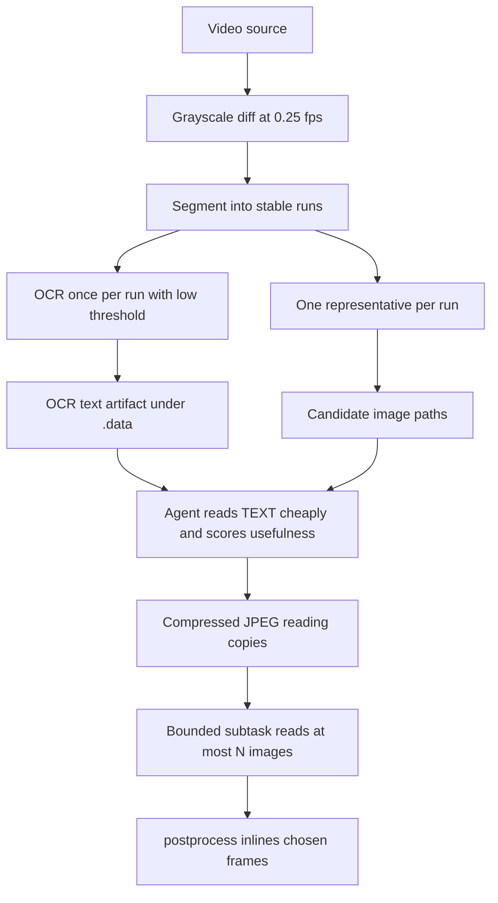

# Plan: image pipeline rework, content routing, and MCP transport

Status: **COMPLETE — Steps A–G plus §12 (compressed reading copies) DONE and verified.
Test-count floor 951.** A parent fix followed §12: the escalation had undone D-2's
one-OCR-per-run (96 calls for 96 frames); it now inherits the run's single call (§2).

This file is written so a fresh task can resume without re-deriving anything.
Everything marked *measured* was observed in this repo or in a run's own
artifacts; anything else is labelled as a claim.

---

## 1. How to drive this plan (read first)

### 1.1 The subtask-receipt protocol

This thread lost a subtask's result **twice**: a completed, on-disk deliverable
whose result message never arrived. Both times the parent had to reconstruct
state by hand. So the protocol is part of the plan, not a nicety:

1. **Every subtask ends by writing a receipt file**, whether it succeeded or
   failed:
   `feedback/subtask-<id>-<slug>.md` (tracked, survives reloads, matches the
   house `feedback/report*.md` convention).
2. **The receipt is the deliverable.** The subtask's returned message may be
   terse. The parent reads the receipt with `read_file` and trusts only that —
   plus the artifacts it names.
3. **The parent must verify three things** before believing a receipt:
   * the file exists and its mtime is **newer than the subtask start** (same
     staleness rule the CLI contract uses for `timestamp`);
   * every artifact it names exists on disk (a path that does not exist is an
     unverified claim);
   * the raw output it quotes is plausible against the code it claims to have run.
4. **No receipt ⇒ the subtask is treated as not run.** A subtask that "completed"
   without a receipt is re-issued or its work re-read from source. An
   interrupted task is left alone (deleting a task awaiting an undelivered tool
   result is what appears to hang); delete it only after a reload.
5. **One step per subtask.** Do not combine steps in one brief — the larger the
   brief, the more that is lost when a result is dropped.

### 1.2 Restart requirements

The user deletes the hung task, reloads VS Code, and opens a fresh task against
this file. That task must **start from the beginning**, regardless of what is
already on disk — hence Subtask A (§5) is an audit, not an implementation.

**All steps A–G are complete and verified (§2).** There is no resuming pointer: the
plan's subtasks are done and the test floor is 912. C's measured inputs are recorded
in §4's "Constraints Subtask C measured"; E's contract is recorded in §9 and
[`skills/_shared/json-contract.md`](skills/_shared/json-contract.md). The receipts are
the state of record:
[`subtask-A-step1-audit.md`](feedback/subtask-A-step1-audit.md),
[`subtask-B-unpack.md`](feedback/subtask-B-unpack.md),
[`subtask-C-ocr-measurement.md`](feedback/subtask-C-ocr-measurement.md),
[`subtask-D-selector.md`](feedback/subtask-D-selector.md),
[`subtask-E-next.md`](feedback/subtask-E-next.md),
[`subtask-F-scratch.md`](feedback/subtask-F-scratch.md),
[`subtask-G-mcp.md`](feedback/subtask-G-mcp.md).
**§12 (compressed reading copies) is now done** (Subtask I; measured by Subtask H).
**The client-side half of §15's MCP premise remains open** — image-block rendering is
outside this repo.

---

## 2. Progress snapshot

| Step | Item | State |
|------|------|-------|
| 0 | Root cause of the 413 loop | **Settled and measured** (§3) |
| A | **Audit of Step 1** — Tesseract provisioning | **Done — green.** [`feedback/subtask-A-step1-audit.md`](feedback/subtask-A-step1-audit.md); all 7 items work, 2 advisories (A-1 `$PLUGINSDIR` residue, A-2 silent-DLL drop) carried into B |
| 1 | Tesseract as a pinned, toolchain-owned component | **Verified by execution** (Subtask A) — engine v5.5.3.20260724, `eng`+`rus`, installer idempotent |
| B | Unpack (NSIS / 7z) as a first-class capability | **Done.** [`feedback/subtask-B-unpack.md`](feedback/subtask-B-unpack.md); `lib/unpack.py` + an `unpack` verb; test floor 720 → **743**; advisories A-1/A-2 both resolved |
| C | OCR measurement: `eng` / `rus` / `eng+rus` per frame | **Done — green.** [`feedback/subtask-C-ocr-measurement.md`](feedback/subtask-C-ocr-measurement.md) + [`subtask-C-ocr-chars.csv`](feedback/subtask-C-ocr-chars.csv) (96 rows, re-verified) |
| D | Selector rework: promote, never drop; one OCR per run | **Done — green.** [`feedback/subtask-D-selector.md`](feedback/subtask-D-selector.md); floor 743 → **770**; all 7 items proved |
| E | `data.next` bridge between pipeline steps | **Done — green.** [`feedback/subtask-E-next.md`](feedback/subtask-E-next.md); floor 770 → **801**; the attach cap is enforced in `build()`, not by the caller |
| F | CLI-owned scratch lifecycle | **Done — green.** [`feedback/subtask-F-scratch.md`](feedback/subtask-F-scratch.md); floor 801 → **841**; default self-cleaning, `-KeepScratch`, `clean -CleanScratch`; ownership is the run-marker name, so foreign dirs are spared |
| G | MCP facade (Python, in-process) | **Done — green (server side).** [`feedback/subtask-G-mcp.md`](feedback/subtask-G-mcp.md); floor 841 → **912**; tool calls run in process, stdout carries protocol only |
| H | Compressed reading copies — measurement | **Done.** [`feedback/subtask-H-reading-copies.md`](feedback/subtask-H-reading-copies.md); the parameters for §12 (ffmpeg `-q:v`, no upscale, the escalation split) |
| I | Compressed reading copies — implementation (§12) | **Done — green.** [`feedback/subtask-I-reading-copies-impl.md`](feedback/subtask-I-reading-copies-impl.md); floor 912 → **950**; `lib/reading.py` + `slides`/`readpdf`/`mcp.facet_next` |
| — | **D-2 regression, caught and fixed by the parent** | Subtask I's escalation scored each frame from **its own** OCR text, so the default `slides` path OCR'd **every frame (96 calls)** instead of one per run (4), silently undoing D-2. Fixed in [`commands/slides.py`](scripts/zoombie/commands/slides.py:350): the score inherits the run representative's text (back-filled after the loop, since the representative is usually the run's LAST frame), so it costs **no** extra OCR. Pinned by `test_reading_copy_does_not_add_ocr_calls`. Floor **950 → 951**. |

**Verification basis (Subtask A, 2026-09-25).** Step 1 was executed for the first
time and audited end to end: `python -m pytest tests` → **720 passed** (≥ 703),
`ocr.available()` → `(True, '5.5.3.20260724')`, `resolve_engine()` → the toolchain
path first, installer provisioning plus a second idempotent run, and `eng`/`rus`
sha256 re-derived and matching the pinned constants. Receipt:
[`feedback/subtask-A-step1-audit.md`](feedback/subtask-A-step1-audit.md).
**720 is the new baseline floor for every later step.** Two advisories are carried
into Subtask B rather than hotfixed: **A-1** `tesseract\$PLUGINSDIR\*.dll` is left in
the runtime tree by `_wanted`'s blanket `.dll` rule, and **A-2** a missing DLL is
dropped silently, so only a missing `tesseract.exe` is loud. `ENGINE["sha256"]`
remains constant-echo only (unverified by an independent hash).

---

## 3. Root cause (settled — do not re-derive)

The 413 was a **payload-size** failure, not a vision failure.

* The failed session returned **8 full-resolution PNG frames** as base64 —
  **6,440,056 base64 chars / 4,830,042 raw bytes** — plus **2,527,618 chars** of
  non-image history across 213 messages: ≈5.7–7.9 M tokens against a 128K
  context, roughly 45–60× over.
* A **bodyless 413** is a gateway/CDN rejecting by byte size before the model is
  reached; a model-side token refusal is a 400.
* The loop was self-sustaining: each retry re-sent the whole, larger history
  while the agent kept reading another 0.5–0.9 MB PNG.
* Every frame was `1280×720` PNG at source resolution (`DEFAULT_SCALE_WIDTH =
  1280`). **Measured:** q3 JPEG of the same frame is **129,038 B vs 940,052 B** —
  **7.3×** smaller at identical resolution, and the compressed copy was read back
  and is fully legible.

Basis: `zoo-diagnostics-01a0d54e-1790356598676.json` (JSONC — strip the leading
`//` lines before parsing), plus `ffprobe`/`ffmpeg` on one Crimson frame.

Consequence: full-size PNGs allow only ~8–12 frames per session against an item
with **96**, and the failure is hard rather than graceful.

---

## 4. Design foundations (agreed)

1. **Tesseract is a proposed dependency, installed like whisper.** Acceptance is
   not "installed" but **`ocr.available()` returning a version** — the two probes
   that disagreed (installer: Program Files; `pytesseract`: PATH) must answer
   identically.
2. **Union, not cascade.** AI set = OCR-promoted ∪ scene-change-promoted −
   intersection, so no frame is analysed twice. Trigger correction: **OCR is
   per-run, not per-magnitude** — a small change can be a whole new slide and a
   large one a camera pan.
3. **Transport in code, judgement in prose.** Paths, encodings, payload size and
   scratch lifecycle are enforced by the CLI or the protocol; only "is this frame
   worth looking at" is prose.
4. **A transport other than cmd/PowerShell.** MCP for UTF-8 and payload shaping;
   the ASCII-work-dir invariant **stays**, because whisper.cpp, PyMuPDF and
   Tesseract need ASCII paths themselves.

**Constraints Subtask C measured (bind Subtask D — do not re-derive):**

* **Char count is not a usefulness signal.** `eng`/`rus`/`eng+rus` medians are
  indistinguishable (123 / 129 / 133) because wrong-script OCR emits comparable
  garbage (`FIGURE 8` → `АСЧЕЕ 8`). Score usefulness from **text content/script**,
  never from length.
* **The deck is mixed:** 12 English-dominant frames, 52 Russian-dominant, 13 zero-text.
  `eng+rus` is the only single run correct for both, at **1.55×** the wall-clock of
  `rus` (82.3 s vs 53.0 s for 96 frames) — and the two densest frames are English
  (032: 2788, 094: 2958). Keep `eng+rus` as the default `-Lang`.
* **13/96 frames return exactly 0 chars and are image-only** (e.g. frame 002 is the
  camera on the host). Nothing lands in the 1–11 band. A text floor would delete
  exactly those 13 — so the covered-run rule (D-4) is *necessary*, and the floor
  becomes **reporting only** (D-3).

### 4.1 The two-stage filter (core idea)

Text is cheap in tokens; images are not, so the expensive reader is gated by the
cheap one: OCR text first, let the agent score usefulness from text, and only
then spend on images.



The text floor becomes a *reporting* threshold, not a drop rule. Subtask D's
measurement corrected this further: it is **no floor at all**, because Subtask C
proved char count is not a usefulness signal — `chars` survives only as a reported
fact, and judgement is carried by the text's `script`. `DEFAULT_MIN_TEXT_CHARS`
(12) is now purely the threshold at which a frame is *labelled* likely-image-only.

---

## 5. Subtask A — audit of Step 1 (**first action**)

**Goal.** Establish, by execution, whether the claimed Step 1 actually works.
Do not implement anything. Do not trust this document's summary of the code.

**Method.** Read the four files, then run and record:

1. `python -m pytest tests` — report the **exact** count. The pre-work baseline was
   703 and the new module adds cases in `tests/test_tesseract.py`; from Subtask A
   onward the **floor is 720** (measured) and every later step must not regress it.
2. `python -c "from zoombie.lib import ocr; print(ocr.available())"` — the
   acceptance criterion. Expect a version string, not an error.
3. `python -c "from zoombie.lib import tesseract; print(tesseract.resolve_engine())"`
   — expect the toolchain path first, not PATH.
4. `python -m zoombie.install` — does it provision into `zoombie-env\tesseract\`
   with `eng` + `rus` traineddata? Then a **second** run: is it idempotent
   (no re-download, component reported up to date)?
5. Inspect `env.json` / the install report for
   `manifest.tesseract.{engine,version,languages,expectedLanguages}`.
6. **Re-derive at least one pinned sha256 yourself** (compute the hash of an
   already-downloaded artifact, or of a re-download) and compare it to the
   constant in [`lib/tesseract.py`](scripts/zoombie/lib/tesseract.py:75). The
   constants are currently only *claimed* to have been measured.
7. Confirm no scratch is left under the toolchain root or the user's workspace
   after a run.

**Specific review items to settle** (all previously raised in this thread) —
**SETTLED by Subtask A and closed by Subtask B; kept for the record, do not re-open:**

* `_wanted()` ends in `return False`, so an unrecognised payload file is dropped
  silently. Is a missing **DLL** as loud as a missing `tesseract.exe`? A
  `--version` check after extraction would catch it.
* Retracted and NOT to be re-raised: `install_languages` has no `TypeError` — the
  line is a conditional expression, `os.path.join(...) if dest_dir else tessdata_dir()`.
  *(Subtask A re-read the source and confirmed the retraction stands.)*
* Confirm the ASCII-root invariant holds for a `%PUBLIC%` profile.
  *(Subtask A measured it: `env_root()` step 3 → `C:\Users\Public\zoombie-env`, `is_ascii` true — holds.)*

The first bullet (a missing DLL dropped silently) was **confirmed valid** by
Subtask A and **fixed** by Subtask B's exit-code probe in
[`lib/unpack.py`](scripts/zoombie/lib/unpack.py:259); the `$PLUGINSDIR` residue it
implied is fixed by directory-scoped filtering in
[`copy_payload()`](scripts/zoombie/lib/unpack.py:333). Subtask B also **corrected the
mechanism**: a missing DLL does not print a banner and exit non-zero — the process
never starts (`0xC0000135`, no output), which is why the remedy is an exit-code gate.

**Verify the audit by source, not by summary.** At minimum read
[`lib/tesseract.py`](scripts/zoombie/lib/tesseract.py:1),
[`lib/ocr.py`](scripts/zoombie/lib/ocr.py:1),
[`install/components.py`](scripts/zoombie/install/components.py:523) and
[`tests/test_tesseract.py`](tests/test_tesseract.py:1).

**Deliverable.** `feedback/subtask-A-step1-audit.md`, containing: raw command
output for each of the 7 items; a per-item verdict (works / broken / unverified);
the re-derived hash; and a list of any claim in this plan that the evidence
contradicts.

**Blocks.** Subtasks B–G. Nothing else should start until A reports.

---

## 6. Subtask B — unpack as a first-class capability

**Goal.** Promote the 7z/NSIS machinery out of `tesseract.py` into a general,
agent-invisible capability.

**Why.** It is not Tesseract-specific, and it is precisely the work an agent
should never do by hand: manual unpacking pollutes the user's workspace and then
burns tokens listing files it should not have read.

**Deliverable.**

* `lib/unpack.py`: extractor provisioning + NSIS/7z extraction, extracted from
  [`lib/tesseract.py`](scripts/zoombie/lib/tesseract.py:289); `tesseract.py`
  imports it. `lib/archive.py` stays zip-only and stdlib-only.
* CLI verb: `unpack -Source <exe|7z> -Output <dir> [-Strip <n>] [-Include <glob>]`,
  honouring `Modes` (`-Check`/`-DryRun`/apply), ASCII work dir, results copied to
  the confirmed destination.
* Extractors provisioned as their **own** manifest component.
* Tests: dry-run writes nothing; hash mismatch refused; strip/include filtering;
   a live NSIS fixture is not required — reuse the hermetic fake-extractor pattern
   in [`tests/test_tesseract.py`](tests/test_tesseract.py:83).
* **Absorbs the two Subtask A advisories** (measured in
   [`feedback/subtask-A-step1-audit.md`](feedback/subtask-A-step1-audit.md); do not
   hotfix them in `tesseract.py` — B is their home):
  * **A-1 — the residue.** `_wanted`'s blanket `name.endswith(".dll")` rule admits
    *every* DLL, so NSIS scaffolding under `$PLUGINSDIR\` is copied into the runtime
    tree (`tesseract\$PLUGINSDIR\{INetC,LangDLL,nsDialogs,StartMenu,System,UserInfo}.dll`,
    96,768 B). The promoted extractor must filter by **directory**, not extension.
  * **A-2 — the silent drop.** A payload DLL that is renamed or removed is dropped
    by `_wanted`'s terminal `return False` with no error, while a missing
    `tesseract.exe` raises loudly from `_find_engine()`. Add a post-extraction
    `--version` probe that gates on the **exit code**: today
    [`engine_version()`](scripts/zoombie/lib/tesseract.py:197) accepts a non-zero
    exit as long as a banner printed, and `install_tesseract` gates only on the
    version being non-`None`.

**Receipt.** `feedback/subtask-B-unpack.md`.

**Depends on.** A green.

---

## 7. Subtask C — the OCR measurement

**Goal.** Answer, with numbers, whether the OCR branch earns its cost.

**Deliverable.** OCR the Crimson item's ~96 frames at `eng`, `rus` and
`eng+rus`; report **chars-per-frame** distributions (min/median/max) and, for a
small sample, a usefulness judgement. Input item:
`kb\Crimson\4 - 09.04.2020 - Дивиденды во время чумы и после нее - принципы выбора акций`,
frames in `.data/img/`.

**Why now.** With the two-stage filter, this is no longer about choosing a text
floor — it decides whether the OCR branch exists at all, and it is cheap enough
to run on the text track before the selector is built.

**Receipt.** `feedback/subtask-C-ocr-measurement.md` with the raw table.

**Depends on.** A green (needs a working engine).

---

## 8. Subtask D — selector rework

In [`commands/slides.py`](scripts/zoombie/commands/slides.py:1) and
[`lib/slides.py`](scripts/zoombie/lib/slides.py:1):

1. Replace 1.0 fps hashing with **0.25 fps** grayscale diff for boundary/run
   detection (`rawvideo`, the source `dhash_bits` already uses). Keep dHash for
   reporting only — it cannot see a fade.
2. **One OCR per run**, plus samples inside long runs. Today's 1 fps post-dedup
   gate can cost ~300 OCR calls for one 5-minute slide.
3. **Never drop on text.** [`low_text_reason`](scripts/zoombie/commands/slides.py:195)
   currently deletes below `MIN_TEXT_CHARS`; text becomes promotion/reporting only.
4. **Covered-run rule:** every stable run contributes ≥1 frame to the AI set
   regardless of text and diff — one image per run, and it prevents the
   image-only-slide loss.
5. Dedup by perceptual hash across the union; report drops **and reasons** in
   `data.images.skippedReasons`.
6. Write OCR text to a data artifact, not into the result payload.
7. Tests: an image-only run is never discarded by the text floor; no frame is
   analysed twice; `-DryRun` writes nothing.

**Measured inputs (Subtask C — use these, do not re-measure).** OCR medians
`eng` 123 / `rus` 129 / `eng+rus` 133 chars/frame; `eng+rus` costs 1.55× `rus`;
13/96 frames are exactly 0 chars and image-only; char count is *not* a usefulness
signal, so score on text content/script. Full evidence:
[`feedback/subtask-C-ocr-measurement.md`](feedback/subtask-C-ocr-measurement.md).

**Receipt.** `feedback/subtask-D-selector.md`. **Depends on.** C (done).

---

## 9. Subtask E — the `data.next` bridge

Every result carries a recommended next step, so skills describe a graph rather
than a procedure to remember:

```
data.next = {
  command, args, why,             // the recommended next invocation
  attach: [...],                  // what the agent may read inline, hard-capped
  budget: { images: n, bytes: m } // what the agent is about to spend
}
```

The enforcement is the point: the CLI refuses to emit more than N attachable
images per result. This replaces a prose rule a tired agent drops, using the same
pattern as the existing no-overwrite refusals and `-DryRun`.

**Receipt.** [`feedback/subtask-E-next.md`](feedback/subtask-E-next.md) — **done**.
**Depends on.** D (done). Reuse its `data.next` / attach-cap contract in F and G; the
block lives in [`lib/next.py`](scripts/zoombie/lib/next.py:1) and is emitted by
`slides`/`readimages`/`readpdf`/`postprocess`.

---

## 10. Subtask F — CLI-owned scratch lifecycle

* Per-run scratch under the **toolchain root**, never the user's workspace and
  never `C:\Temp`.
* `-KeepScratch` to retain, a `-CleanScratch` verb to remove.
* Why: cleanup is currently a prose obligation. The failed session discharged it
  by hand, and the skill tells the *agent* to delete `-Vision`/`-ImageDir` output.
* Ordering: the agent reads renders *after* the run, so cleanup cannot precede
  the bounded read — F depends on E.

**Receipt.** `feedback/subtask-F-scratch.md`.

---

## 11. Subtask G — MCP facade

* **Our own process, not a module injected into another product.** The client
  declares a command + args and spawns it; JSON-RPC over stdio. C# is possible
  (official SDK, `[McpServerToolType]` attributes) but would be a *second*
  implementation of tested behaviour — Python in-process is the choice.
* Launch as `zoombie-env\python\python.exe -m zoombie.mcp`; call
  `commands/*.run(args)` **in process**, never shelling out to `zoombie.cmd`.
* Why in-process is decisive: no `cmd.exe`, no console codepage — the UTF-8
  problem is solved at the source, replacing `@file` staging, and the server
  decides the shape of a result (downscaled image, text only, or a handle).
* Long stages get `start` / `status` / `result` instead of one blocking call.
* The JSON contract is already transport-agnostic — one line of
  `{ ok, action, error, data, timestamp }` — so this is a thin facade.
* **It does not by itself reduce context.** A tool returning 96 image blocks still
  overflows; what it buys is capping, shaping, pagination and handles. That is
  why D–F must land first.

**Receipt.** `feedback/subtask-G-mcp.md`. **Depends on.** D–F.

---

## 12. Independent: compressed reading copies — **DONE** (Subtask I)

Implemented in [`lib/reading.py`](scripts/zoombie/lib/reading.py:1), wired into
[`commands/slides.py`](scripts/zoombie/commands/slides.py:1) and
[`commands/readpdf.py`](scripts/zoombie/commands/readpdf.py:1), and consumed by
`mcp.facets.next`. Receipt: [`feedback/subtask-I-reading-copies-impl.md`](feedback/subtask-I-reading-copies-impl.md);
parameters measured by [`feedback/subtask-H-reading-copies.md`](feedback/subtask-H-reading-copies.md).

When a frame is handed to the agent, write an **ffmpeg `-q:v 3` JPEG reading copy
at the source resolution** and report *that* path in `visionFrames` /
`next.attach`. The PNG stays the deliverable `postprocess` inlines and the OCR
input. The copies live in a dedicated `readings/` subdirectory of the image
directory, so `image_count`, the manifest, the README and the MCP facet stay
PNG-only, and the copy is never inlined into `summary.md`.

**H's measurement is the parameter source; do not re-derive it:**

* **"q3" means ffmpeg `-q:v 3` (qscale), NOT PIL/Pillow `quality=3`.** H measured
  129,038 B vs ~19,000–29,765 B on the same frame, and the PIL version destroys the
  text. The measured 129,038 B / 7.3× on frame 010 is reproduced exactly under the
  ffmpeg qscale only.
* **The source resolution stays** (1280 wide; 1653 wide for a rendered PDF page).
  The 1600-wide upscale is **struck**: H measured it as ~1.25× the bytes of
  q3@1280 for *more* numeric-token loss, because interpolation invents tokens.
* **The quality escalates to `-q:v 2` for dense small-numeral frames.** q3 is safe
  at ≥ 8 px ink height only; the real dense frames carry 5–8 px figures, where q3
  silently substitutes digits. The rule is a single constant plus a pure function
  ([`count_numeric_tokens()`](scripts/zoombie/lib/reading.py:123),
  [`quality_for()`](scripts/zoombie/lib/reading.py:135)) keyed on the **numeric-token
  count** of the frame's OCR text — H's own fidelity metric, not a char count (H
  showed 085 *gains* 333 chars at q3 while getting noisier). H's counts are
  **032 = 100, 094 = 80, 096 = 48** (escalate) vs **085 = 11, 010 = 0** (stay), so
  `DENSE_NUMERIC_TOKENS = 20` sits inside the wide 11..48 gap. When OCR text is
  unavailable (`-NoTextGate`, no engine, an OCR-skipped frame) the default q3 is
  used and the reason says so.
* **The escalation MUST NOT add an OCR call.** It is scored from each frame's
  `record["ocrText"]`, which is the frame's own text when OCR ran for it and
  **otherwise its run representative's** — so a run's one D-2 call scores every frame
  in it. Scoring each frame from a *fresh* call undid D-2 (96 calls instead of 4 on
  the real item); Subtask I did that and the parent reverted it (§2). Any future
  change here must keep `test_reading_copy_does_not_add_ocr_calls` green.
* **The format split is enforced by shape:** OCR reads the PNG, `postprocess`
  inlines the manifest's PNG, and only the agent's *inline reading copy* is a JPEG.
* **`data.next.budget.bytes` reports the JPEG sizes**, not the PNG sizes — the
  point of §9 is that the agent knows what it is about to spend. Same for
  `readpdf`'s `visionPages`.
* `-NoReadingCopy` (on `slides` and `readpdf`) advertises the PNGs and writes no
  copies; `-DryRun` writes nothing.
* Reading copies **persist** (they are read after the run, the same ordering
  constraint as E/F), and are pruned only against our own `*.q<N>.jpg` names, so a
  re-run is idempotent and never accumulates stale siblings.

**Corrected claims (see H's §11):** §12's "fully legible at 1280×720" holds only
for the poster frame 010 and for ≥ 8 px text; the 7.3× is the poster frame (the
item's single largest PNG — the dense-frame ratio at q3 is 2.5–3.2×), so
"~8–12 frames/session becomes ~30–40" is optimistic for a dense item.

---

## 13. Verification checklist (for the new task, in order)

- [x] Subtask A receipt exists and is newer than the task start (§1.1 rule 3). — [`feedback/subtask-A-step1-audit.md`](feedback/subtask-A-step1-audit.md), verified independently.
- [x] `python -m pytest tests` count recorded and ≥ the 703 baseline. — **720 passed**, re-measured; the floor for every later step is now ≥ 720.
- [x] `ocr.available()` returns a **version** — the acceptance criterion. — `(True, '5.5.3.20260724')`.
- [x] `resolve_engine()` reports the toolchain path, not PATH. — `…\zoombie-env\tesseract\tesseract.exe`, reason "toolchain engine".
- [x] Installer provisions the engine + `eng`/`rus`; a second run is idempotent. — run 1 provisioned; run 2 "tesseract present … langs: eng, rus".
- [x] `manifest.tesseract.{engine,version,languages,expectedLanguages}` populated. — **in the install result envelope's `manifest.tesseract` AND `env.json`'s top-level `tesseract`**; the plan's field path (as if inside `env.json`) is wrong (§5 item 5).
- [x] At least one pinned hash re-derived independently. — `eng` + `rus` match their constants; `ENGINE["sha256"]` stays constant-echo only (unverified).
- [x] **No scratch left** — resolution corrected by Subtask B: per-run `tmp\zoombie-*` were always removed, and the `tesseract\$PLUGINSDIR\*.dll` residue (A-1) is now fixed by directory-scoped filtering in [`copy_payload()`](scripts/zoombie/lib/unpack.py:333). A `-Force` reinstall of the already-provisioned tree would clear the historical copy; the installer was deliberately not re-run.
- [ ] `setup.md` and the deployed skills agree with the new wording. — not audited; run 1 found the deployed skills stale and refreshed them.
- [x] Then, and only then, subtasks B–G in order, each with its own receipt. — A, B and C are done and verified; **D is next**, then E–G.
- [x] Subtask B receipt verified: 743 passed (≥ 720), `EXTRACTOR is unpack.EXTRACTOR`, `lib/archive.py` untouched, all named artifacts on disk.
- [x] Subtask C receipt verified: 96 frames / 96 rows, distributions reproduced exactly, 13 zeros in each config, 0 errors.
- [x] Subtask D receipt verified: 770 passed (≥ 743), `test_slides.py` 76, all 7 items proved, `-DryRun` writes nothing live.
- [x] Subtask E receipt verified: 801 passed (≥ 770), `test_next.py` 31, cap enforced inside `build()` with `attachCap`/`count`/`truncated`/`overAttach` reported.
- [x] Subtask F receipt verified: 841 passed (≥ 801), `test_scratch.py` 40, `tmp\` foreign dirs spared and `work\` empty after a sweep.
- [x] Subtask G receipt verified: 912 passed (≥ 841), `test_mcp.py` 71, a live `tools/list` round trip read back with **one stdout line** and the banner on stderr.
- [x] §12 compressed reading copies verified: 950 passed (≥ 912), `test_reading.py` 37, the live dense-frame routing reproduces H's table exactly (032/094/096 → q2, 085/010 → q3), `budget.bytes` is the JPEG size, the manifest/README/`image_count` stay PNG-only. Receipt: [`feedback/subtask-I-reading-copies-impl.md`](feedback/subtask-I-reading-copies-impl.md).
- [ ] **Remaining, not subtask work:** the MCP **client-side** half of §15's premise (image-block rendering is outside this repo).

---

## 14. Non-goals

* Choosing a .NET MCP implementation.
* Changing the JSON contract's shape.
* Changing `postprocess`, anchors, or the 6-block contract.
* Re-transcribing the Crimson item: the looped 00:47–00:56 window is already
  recovered via the `-From`/`-To` window feature.

## 15. Open questions

* The **licensing and durability** of shipping extracted installer payloads, and
  of depending on 7-Zip's NSIS handler, are unexamined.
* ~~Is the OCR branch worth it on video frames at all?~~ **Answered by Subtask C:**
  it is worth it, but not as a *length* signal — wrong-script OCR returns comparable
  garbage, so only text content/script discriminates. The open residue is that
  13/96 frames carry no text at all, which is why the AI set must be seeded by the
  covered-run rule rather than by OCR output.
* ~~Whether this harness surfaces MCP image content and progress per spec is
  unverified — the one premise Subtask G rests on.~~ **Split by Subtask G:** the
  **server side is now proved** (round trip, in-process routing, stdout purity, the
  attach cap, `start`/`status`/`result`, JSON-RPC error shapes). The **client-side
  rendering of image blocks remains unverified and is outside this repo** — Subtask G
  states this plainly rather than implying end-to-end success.
* Does a stateful MCP server add a "server not running" failure mode that
  outweighs its benefits? Mitigation: facade over an unchanged CLI, never a
  rewrite.
