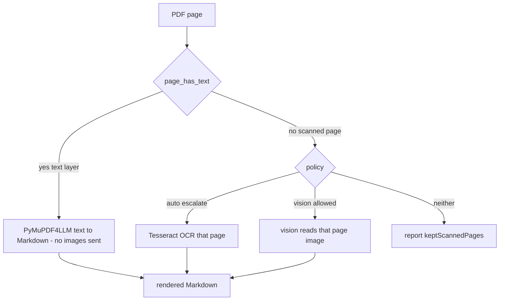
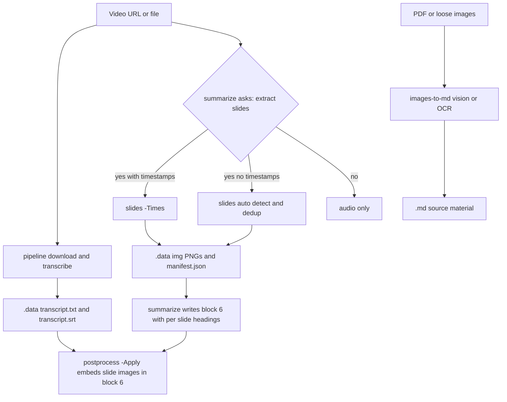

# Plan: generalize slides-to-md into images-to-md, with opt-in slide extraction

## Goal

Three linked outcomes:

1. **Generalize the "slides to md" idea into `images-to-md`** — one capability that
   turns *any* visual source (a PDF, loose image files, or extracted video frames)
   into Markdown, with the **vision model as the default reader** and **Tesseract
   OCR as the deterministic fallback**. So OCR is available for PDFs *and* images.
2. **Make slide extraction an opt-in question during video summarization** — the
   skill asks "should I also try to extract slides?", then asks whether the user has
   **exact timestamps**; with timestamps only those frames are extracted (minimal
   image count), otherwise auto-detection plus dedup is used.
3. **Embed the slides in `summary.md` block 6** — the verbatim source copy carries
   the slide images inline, through the existing, deterministic `postprocess` image
   pass. The transcript itself stays `.data/transcript.txt` + `.srt`.

## Reading policy: text-first, vision/OCR on demand

This is a hard rule, not a default: **a PDF with extractable text is NEVER routed
through image recognition or OCR.** Vision/OCR is an escalation for exactly two
cases, and it is applied **per page**, never to the whole document.



- The default for a normal document is the existing PyMuPDF4LLM path with **zero**
  image tokens and zero OCR, identical to today's [`readpdf`](scripts/zoombie/commands/readpdf.py:110).
- A page is escalated **only when it has no extractable text** — detected by the same
  [`page_has_text()`](scripts/zoombie/lib/pdf.py:173) already used to group pages in
  [`build_markdown()`](scripts/zoombie/lib/pdf.py:553).
- Only the scanned pages are imaged and read; the text pages in the same document are
  never rasterized. This keeps the image count proportional to what is actually
  unreadable, not to the document length.
- Two ways to resolve a detected scan: **`-Ocr`** (Tesseract, deterministic) or
  **`-Vision`** (the model reads the rendered page image). The **skill asks** which
  one when a scan is found, and reports `data.keptScannedPages` when the user
  declines, so a skipped scan is never silent (the behaviour today's `-Ocr`
  opt-in already has).
- The same rule applies to the video slide path: reading slide *frames* with vision is
  the point there, because a frame has no text layer at all. That is not an exception
  to the policy — it is the case the policy reserves the vision path for.

## Why this shape fits the existing repo

- The reading pass already has the exact two-layer split to copy: a native,
  package-import-free engine in [`lib/pdf.py`](scripts/zoombie/lib/pdf.py:1) and a
  thin orchestration command in [`commands/readpdf.py`](scripts/zoombie/commands/readpdf.py:110).
- The image **manifest contract** already exists
  ([`ImageInfo.to_manifest()`](scripts/zoombie/lib/pdf.py:157) and
  [`images_sidecar()`](scripts/zoombie/lib/pdf.py:510)) and `postprocess` already
  strips and re-inserts images from `img/manifest.json`
  ([`insert_images()`](scripts/zoombie/commands/postprocess.py:536)). A slide is
  therefore an image row whose bbox is replaced by a **time window**.
- The **timestamp axis** already exists ([`SrtIndex`](scripts/zoombie/lib/srt.py:176)),
  so a slide's `anchor_text` can be computed deterministically as the narration
  spoken during its interval, and the existing normalized word-window matcher
  ([`_match_anchor()`](scripts/zoombie/commands/postprocess.py:679)) places the
  image under the right block-6 paragraph with no new matching code.
- No new native dependency: ffmpeg is already required by
  [`extract`](scripts/zoombie/commands/extract.py:38).

## Architecture



The video flow keeps the two channels separate until the time join: **audio** stays
with `pipeline`, **video** becomes slide images via a new `slides` command, and the
manifest's `anchor_text` is the only bridge between them.

## New / changed CLI

### `slides` (new command) — video to slide frames plus manifest

Local video file in (the media is retained at the item root by
[`_retain_source()`](scripts/zoombie/commands/pipeline.py:21); a URL is downloaded
first by the skill via `download`). Emits PNGs and the image sidecar into the item
image directory.

```text
zoombie slides -Source <video> -Output <item-dir> [-ImageDir <dir>]
  [-Times "hh:mm:ss,hh:mm:ss,..."]     # exact timestamps: one frame each, minimal set
  [-TimesFile <path>]                  # timestamps read from a file, one per line
  [-Srt <path>]                        # narration for anchor_text (default: sibling transcript.srt)
  [-Scale 1280] [-MinSlideSec 2] [-HashDistance N] [-MinPx N]
  [-KeepWork] [-Force] [-DryRun]
```

- **With `-Times`/`-TimesFile`**: extract exactly one frame per timestamp. This is
  the minimal-image fast path the user asked for; the kept count equals the number
  of timestamps, with no detection or dedup needed.
- **Without timestamps**: sample at a low cadence (default ~1 fps), dedup with a
  **dHash plus Hamming distance** (the perceptual analogue of the `digest` dedup at
  [`pdf.py:375`](scripts/zoombie/lib/pdf.py:375)), merge flaps shorter than
  `-MinSlideSec`, and keep the **last** frame of each stable run so an animated build
  is captured complete.
- `anchor_text` per slide = the SRT cues overlapping its interval, normalized the
  same way `postprocess` normalizes paragraphs, so anchoring works verbatim.
- Result `data`: `{ images:{path,count,manifest}, sourceDurationSec, mode, candidateFrames, keptFrames, intervals:[{file,timeSec,endTimeSec}] }` — the ratio `keptFrames / candidateFrames` is reported so the dedup is measurable, not assumed.

### `readimages` (new command) — loose images to Markdown via OCR

The "OCR for images" path required by outcome 1. Reads a file or a directory of
images and emits Markdown, reusing the manifest conventions.

```text
zoombie readimages -Source <image-or-dir> -Output <basename> [-Ocr] [-Lang eng] [-Force]
```

- `-Ocr` runs Tesseract over each image (the fallback when the model is not
  vision-capable or the user wants deterministic text).
- Without `-Ocr` it still records the images and the sidecar so the *skill* can read
  them with vision; the command never guesses text.

### `readpdf` (changed: scan escalation only, never whole-document)

Text extraction is unchanged: PyMuPDF4LLM for pages that have a text layer, which is
the overwhelmingly common case and costs no image tokens
([`pdf.convert()`](scripts/zoombie/lib/pdf.py:606)). The change is what happens to a
**scanned** page — the only page type ever rasterized — which gets one of two explicit
routes.

```text
zoombie readpdf -Source <pdf> -Output <basename> [
    -Ocr            # escalate ONLY the scanned pages to Tesseract
  | -Vision         # escalate ONLY the scanned pages to the vision reader
  |                 # default: leave scans as keptScannedPages (reported, not silent)
  ] [-Lang eng] [-Images] [-ImageDir <dir>] [-Pages ...] [-Force] [-DryRun]
```

- A page with a text layer is **never** imaged, under any flag.
- `-Ocr` and `-Vision` are the fallback pair for scan escalation; the existing `-Ocr`
  behaviour and its `keptScannedPages` reporting are preserved, so no current caller
  changes.
- The skill asks which route to use only when `data.keptScannedPages` is non-empty.

## Shared library

- **`lib/slides.py`** (new) — the ffmpeg engine, package-import-free like
  [`pdf.py`](scripts/zoombie/lib/pdf.py:1): timestamp parsing, argv assembly in the
  style of [`extract.py:55`](scripts/zoombie/commands/extract.py:55), frame decode,
  dHash plus Hamming dedup, interval to `anchor_text` join, and manifest/README
  writing via the shared sidecar renderer.
- **`lib/ocr.py`** (new) — a reusable `ocr_image(path, lang)` for loose images. Note
  the justified duplication: [`pdf.py`](scripts/zoombie/lib/pdf.py:1) is deliberately
  import-free so the standalone `scripts/pdf/extract_pdf.py` wrapper works, so its
  page OCR stays where it is and this module serves the new commands.
- **Manifest compatibility** — reuse the row shape of
  [`ImageInfo.to_manifest()`](scripts/zoombie/lib/pdf.py:157) and keep the `img/`
  path fragment intact (load-bearing for the strip pass, see the note in
  [`item/paths.py`](scripts/zoombie/item/paths.py:22)):

| Field | PDF meaning | Slide-video meaning |
|-------|-------------|---------------------|
| `file` | `001 - p01.png` | `001 - 00-01-23.png` |
| `timeSec`, `timecode`, `endTimeSec` | absent | new: the slide interval |
| `anchor_text` | text block above the figure | narration spoken during the interval |
| `page`, `xref`, `bbox` | placement | absent or null |
| `digest`, `bytes`, `width`, `height` | reuse | reuse |

## Skills

### Generalize `zoombie-pdf-to-md` into `zoombie-images-to-md`

- Rename the skill and broaden its scope: PDF, loose images, or a directory of
  images in; Markdown out. The reader is chosen **per input**: a text PDF uses
  PyMuPDF4LLM and costs nothing, only pages with no text layer escalate, and only
  loose images go to a reader at all.
- **Never escalate a text PDF.** If `readpdf` reports no `keptScannedPages`, the
  document is done — do not re-run it through OCR or vision. When a scan IS reported,
  ask the user which route to take (`-Ocr` deterministic, or vision), then re-run.
- **Zero-vision by default.** A whole-document image/OCR pass happens only when the
  input is intrinsically visual (loose images) or a scan is detected — never because
  a flag was set out of habit.
- Bump `SKILL_VERSION` in [`__init__.py`](scripts/zoombie/__init__.py:1) and update
  every marker plus the README skills table.
- **Removal handling**: a renamed skill leaves the old `zoombie-pdf-to-md` file
  behind in `%USERPROFILE%\.roo\skills\`. Add pruning of skills no longer present in
  [`skills/`](skills/) to the deployment logic in
  [`lib/skills.py`](scripts/zoombie/lib/skills.py:1) (or document a manual removal),
  otherwise two skills advertise the same job.

### `zoombie-summarize` — the opt-in slides question

Insert a new conditional step (only when the source is a video — `source.json`
`kind` is `video`, or a retained media file is present):

1. Ask: *"Should I also try to extract slides from the video?"*
2. If yes, ask: *"Do you have exact timestamps for the slides?"*
   - **Yes** — collect the timestamps and run `slides -Times "..."`, extracting a
     minimal, exact set of frames.
   - **No** — run `slides` to auto-detect and dedup.
3. Optionally read the slide text (vision) to enrich block 3; never re-run the
   transcript.
4. Run `postprocess -Apply` so the slides are embedded in block 6.

Convention that makes the embedding work (a skill rule, not code): block 6 is written
with one `###` per slide and **the first paragraph under each heading is the
narration** for that slide, so [`_match_anchor()`](scripts/zoombie/commands/postprocess.py:679)
matches `anchor_text` and stamps the heading via [`stamp_headings()`](scripts/zoombie/commands/postprocess.py:283).

### `zoombie-transcribe-video`

Mention the slides option in its hand-off note, so the summarize step is expected.

## `postprocess` — one small optional extension

When a manifest entry carries `timeSec`, prefer that time over the fuzzy
[`SrtIndex.find`](scripts/zoombie/lib/srt.py:265) search for the owning heading's
timestamp. Deterministic time beats a fuzzy text match. Everything else — the strip
pass, the anchor matching, block 4 — stays unchanged, so the byte-idempotency
guarantee holds.

## Item contract

An item after the slides step:

```text
<item>/
    summary.md                     block 6 embeds the slides inline
    <source media>                 retained video
    .data/
        img/                       001 - 00-01-23.png, manifest.json, README.md
        transcript.txt, transcript.srt, source.json, item.json
```

`verify` needs **no change**: it already requires `manifest.json` plus `README.md`
in every `img/` directory and resolves image links
([`verify_tree()`](scripts/zoombie/commands/verify.py:296)).

## Guards and gates

- **Prefer a companion deck**: if a PDF or PPTX of the deck exists, `readpdf` (via
  `images-to-md`) is higher fidelity and near-zero vision tokens; use it and read the
  video only for narration and timing.
- **Skip the visual path when there is nothing visual**: if `slides` keeps 2 or fewer
  slides for a long video, report it and fall back to audio-only summarize.
- **Inherit the invariants**: frames land in an ASCII work dir (native ffmpeg,
  Cyrillic-safe), path budgets via `paths.assert_fits`, no `\\?\` leak into JSON,
  no new native dependency.
- **Never overwrite without asking**; `-Force` only with consent, matching the
  existing commands.

## Tests

- `tests/test_slides.py`: timestamp parsing, dHash/Hamming dedup on a synthetic frame
  set, flap merging, interval to `anchor_text` join against a fixture SRT, and the
  manifest/README rendering.
- `tests/test_ocr.py`: `ocr_image` input handling and the missing-Tesseract error.
- Extend `tests/test_postprocess.py` for the `timeSec` preference.
- The ffmpeg decode itself is native and belongs in `selftest`, not a unit test
  (mirroring how [`tests/test_pdf.py`](tests/test_pdf.py) avoids a real PDF).

## Open decisions

- Skill naming: rename `zoombie-pdf-to-md` to `zoombie-images-to-md`, or keep both
  with the new one delegating to it. Recommendation: rename, and add skill pruning.
- Whether `readimages` is a separate command or folded into `readpdf` as an
  image-input mode. Recommendation: separate, because `readpdf` is PDF-specific and
  its helper contract is PDF-shaped.
