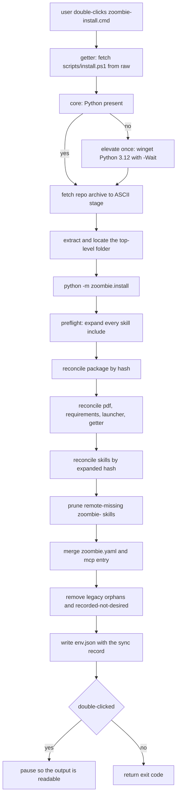

# zoombie-install unification and content-based reconciliation

## Goal

Replace the version-marker-driven, blind-copy install with a **content-based
reconciler** and a **single fire-and-forget entry file**, so that "run
`zoombie-install`" always leaves the machine byte-matching the remote sources —
package `.py`, skills (including the shared blocks), the mode file, and the
launcher — and removes what the remote has dropped. The entry file is
**double-clickable** and holds its console open on finish.

## Why (the two proven defects)

Measured against a live install (`C:\Users\maxim\zoombie-env`), not inferred:

1. **Version markers lie; only content tells the truth.** All six deployed skills
   and the deployed package read `cvrm-zoombie-version: 5.1.0` / `SKILL_VERSION
   = "5.1.0"`, yet:
   - the deployed package is **missing the slides keep/drop feature**
     ([`parse_selection()`](scripts/zoombie/lib/slides.py:273),
     [`apply_selection()`](scripts/zoombie/lib/slides.py:310), the
     [`-Keep`/`-Drop`/`-KeepFile`/`-DropFile`](scripts/zoombie/cli.py:437) flags
     and the MCP schema params in [`mcp.py`](scripts/zoombie/mcp.py:145)); and
   - the deployed [`zoombie-summarize`](skills/zoombie-summarize/SKILL.md:1) is a
     stale 304-line copy with no
     [`frame-selection`](skills/_shared/frame-selection.md:1) block, while the
     source is 248 lines.
   A diff found **4 of 61** package files changed and **1 of 6** skills stale,
   with the marker identical on every one of them.

2. **`-Check` cannot see either defect.** [`deploy_skills()`](scripts/zoombie/install/components.py:876)
   returns `[]` when [`modes.may_write`](scripts/zoombie/install/components.py:63)
   is false, so [`skills.deploy()`](scripts/zoombie/lib/skills.py:163) — the only
   thing that computes the per-skill content action — is never called, and
   [`deploy_cli()`](scripts/zoombie/install/components.py:805) never diffs the
   package. `-Check` therefore printed `Missing: none` while the install was
   stale.

3. **Nothing removes what the remote dropped.** The live root still carries
   orphaned pre-Port files that exist nowhere in the source tree:
   `bin\zoombie\zoombie.ps1` and `bin\zoombie\lib\ZoombieEnv.psm1`. A pure
   `copy_tree` overwrite can never delete them.

## The two layers (the entry file is a GETTER, not an installer)

The entry file must not *contain* install logic, because a saved or locally
installed copy would then be **stale the moment the flow gains a step** (a new
library, a new prerequisite, an elevation change). So the flow is split into a
frozen getter and an always-fresh core:

- **`scripts/zoombie-install.cmd` — the GETTER (distributed, frozen,
  double-clickable).** The single file a user double-clicks, right-clicks Run,
  or invokes from any shell. It does *nothing* but:
  1. resolve the repo slug/ref (`carnivorum/zoombie` @ `main`, honouring
     `ZOOMBIE_REPO_SLUG` / `ZOOMBIE_REPO_REF`);
  2. fetch `scripts/install.ps1` from `raw.githubusercontent.com` to an ASCII
     staging dir (`curl.exe`, else a `.NET`/PowerShell fallback);
  3. run it with the caller's arguments;
  4. **pause so the window does not close**, but only when it was
     double-clicked (see D9);
  5. delete the stage and propagate the core's exit code.
  It contains **no** Python discovery, **no** `winget`, **no** archive logic — so
  a stale copy still installs correctly, because it always fetches the current
  core. It is also written to `<root>\zoombie-install.cmd` at install time, and
  because it is a getter that copy cannot go stale either.

  **Why `.cmd`, not `.ps1`:** on Windows a double-clicked `.ps1` opens the
  editor; only `.cmd`/`.bat` actually runs from Explorer. A `.cmd` also runs
  unchanged from `cmd.exe`, PowerShell and any process spawn, so it is the one
  entry point that satisfies "right-click → Run".

- **`scripts/install.ps1` — the CORE (real installer, may evolve freely).**
  Always fetched fresh by the getter, so it can gain steps without any
  distribution change. It: ensures a usable Python (rejecting the Store stub;
  `winget install Python.Python.3.12` **elevating once** via
  `Start-Process -Verb RunAs -Wait` only when Python is genuinely absent), fetches
  the repo archive (`codeload` zip), extracts it (`tar.exe`, else
  `Expand-Archive`), and runs `python -m zoombie.install`
  (`PYTHONPATH=<repo>\scripts`, `PYTHONUTF8=1`), then returns its code. The
  elevation is `-Wait` and wraps only the one-shot `winget`, so the console whose
  output matters is always the getter's, and its pause covers the whole run.

This is why the runtime CLI never needs a getter (the deployed `zoombie.cmd`
launches stable, self-contained code) but the installer does (its flow is the
thing that changes).

## Decisions

- **D1 — Getter + core, per the reasoning above.** `zoombie-install.cmd` is the
  frozen getter; `scripts/install.ps1` is the evolvable core. The getter is `.cmd`
  for double-click; the core is PowerShell for the single `Start-Process -Verb
  RunAs` elevation and the `.NET` download fallback.
- **D2 — Delete [`bootstrap.cmd`](scripts/bootstrap.cmd:1) and
  [`bootstrap.ps1`](scripts/bootstrap.ps1:1).** The getter absorbs
  `bootstrap.ps1`'s shim role (fetch + run); the core absorbs `bootstrap.cmd`'s
  flow (ensure Python, fetch archive, hand off), re-expressed in PowerShell so it
  can elevate once.
- **D3 — Reconcile by hash, not by version.** For every managed tree, compute
  `relative-path -> sha256` on the desired (fetched) side and the installed side,
  then **write missing/changed and remove installed-not-desired**. The marker
  survives only as an ownership proof for pruning foreign folders.
- **D4 — `-Check` computes the full diff and writes nothing.** Every stage runs
  in dry-run through the same code path, so the reported plan is the real plan.
- **D5 — Removal is scoped to what we recorded.** The reconciler removes a file
  only if it was in the **previous run's recorded file list** or is a named
  legacy orphan — never by blind directory sweep — so a user file that happens to
  sit in a root is never deleted.
- **D6 — Preflight before any write.** All skill sources are expanded (includes
  resolved) up front; an unclosed/unknown include fails **before** the first byte
  is written, so a broken skill can never leave a half-updated package. This is
  the "install might fail due to stale versions in skills" fix: a skill/include
  error aborts cleanly, with nothing partially applied.
- **D7 — Components stay presence-checked, not hash-compared.** ffmpeg,
  whisper.cpp, cuBLAS, the model, Tesseract, 7z and yt-dlp are large and binary;
  they keep their existing detection (sha256 verify on download; presence +
  `-Force` on repair).
- **D8 — The getter stays generic.** Its only knowledge is "where the core lives
  and how to fetch it", so it survives repo-internal changes and elevates the
  core's own currency to the standing invariant: the thing that runs is always
  the published one.
- **D9 — Double-clickable, with a conditional pause.** The `.cmd` getter detects
  Explorer double-click by `%cmdcmdline%` carrying the `/c` form (the canonical
  Windows test the interpreter itself uses), and only then runs `pause` after the
  core returns — so the console does not vanish and swallow the output. The pause
  is **suppressed** by `ZOOMBIE_NOPAUSE=1`, by an explicit `-NoPause`, when
  arguments are passed, and when stdout is redirected, so an automated or agentic
  run can never hang. Right-click "Run as administrator" is not required (the
  install is per-user); the only elevation is the core's one-shot Python step.

## Getter contract (pinned by tests)

- **double-click** runs it and it **pauses** at the end; a shell/arg/redirected
  run does **not** pause;
- runs from **any** working directory (all staged paths absolute);
- never mutates global state (no `reg add`, no `setx`, no permanent PATH);
- contains none of: `winget`, `codeload`, `Expand-Archive`, `zoombie.install`
  (those belong to the core);
- returns the core's exit code, and cleans its ASCII stage in all paths.

## Core contract

- the **only** elevation is the Python-install step, and only when Python is
  absent (`Start-Process -Verb RunAs -Wait` around `winget`, once);
- ASCII staging when `%USERPROFILE%` is not ASCII (fall back to `%PUBLIC%`),
  matching [`paths.env_root()`](scripts/zoombie/lib/paths.py:92);
- Windows PowerShell 5.1 syntax only (no ternary, no `??`, no `-Parallel`);
- passes `-Check`/`-DryRun`/`-Model`/`-Root`/`-Force` straight through.

## Non-ASCII (Cyrillic) safety

The Cyrillic machinery is **not new** — it lives in the Python installer and must
be preserved, not re-invented. The new work is ensuring neither new shell layer
(the getter, the core) breaks when the user name, `%TEMP%`, or the launch folder
is non-ASCII. Three layers, three rules:

**The Python installer (existing — keep and cover).** This is where "select the
target dir" belongs, and it already does the right thing:
- [`paths.env_root()`](scripts/zoombie/lib/paths.py:92) picks
  `%USERPROFILE%\zoombie-env` when that path is ASCII, else
  `%PUBLIC%\zoombie-env`, else `<SystemDrive>\zoombie-env` — a user named `Мария`
  gets an ASCII root by construction;
- [`install/main.py`](scripts/zoombie/install/main.py:99) re-homes a non-ASCII
  **default** root to `%PUBLIC%` and **refuses** a non-ASCII `-Root` the user
  passed explicitly, with the reason (whisper.cpp cannot open such a path);
- every scratch/archive download stages under the ASCII root
  ([`paths.new_temp_dir()`](scripts/zoombie/lib/paths.py:73)), and all managed
  I/O goes through the `\\?\` helpers. None of this may regress.

**The getter (`zoombie-install.cmd`) — location-independent.** A `.cmd` run from
a Cyrillic folder (a double-clicked file on `Рабочий стол`, or a shell whose cwd
is non-ASCII) must not pass a non-ASCII path to `curl.exe` or to the core:
- **never use `%~dp0` or `%CD%` for staging** — they are the non-ASCII part;
- stage on an ASCII base chosen in order: `%TEMP%` if ASCII, else `%PUBLIC%`,
  else `%SystemDrive%\` (the same rule [`paths.env_root()`](scripts/zoombie/lib/paths.py:92)
  uses, re-expressed in batch);
- download `scripts/install.ps1` to that ASCII stage and invoke it by absolute
  path, so the current directory is irrelevant;
- pass the caller's arguments through **unquoted-safe** — the only install
  argument that reaches the core is `-Root`, which must be ASCII anyway;
- own the pause (D9) — cmd's `pause`, not the core's, so the getter is the one
  console that must survive.

**The core (`scripts/install.ps1`) — ASCII staging + forced child TEMP.** It
fetches and extracts the whole repo, so the stage and the extracted checkout must
be ASCII even when `%USERPROFILE%` is not:
- reuse the getter's ASCII-base rule for the zip and the extraction dir (do not
  use `%TEMP%` blindly — it inherits a Cyrillic profile);
- before invoking the child, set **`TEMP`/`TMP` to an ASCII dir** so anything the
  core or `python -m zoombie.install` creates via `%TEMP%` stays ASCII (this
  mirrors what [`bootstrap.ps1`](scripts/bootstrap.ps1:153) does today and must
  be carried over verbatim, then restored in a `finally`);
- set `PYTHONUTF8=1` and `PYTHONPATH=<stage-repo>\scripts` (both ASCII);
- quote every path handed to `curl.exe`/`tar.exe`/`Expand-Archive`/`python`, and
  pass `-Root`/`-Model` through as separate argv elements, never re-parsed from a
  string.

**The reconciler — managed I/O only, never cwd.** It reads/writes
`<root>\bin\zoombie` (ASCII), the skills root (`%USERPROFILE%\.roo\skills`, which
**is** non-ASCII when the profile is), and the `custom_modes.yaml` /
`mcp_settings.json` under `%APPDATA%` (also possibly non-ASCII). Every path goes
through [`paths.to_extended()`](scripts/zoombie/lib/paths.py:161), so hashing,
copying and removing are non-ASCII safe — and no string is built from `os.getcwd()`.

**Net invariant:** the getter and core only ever *stage on ASCII*; the Python
installer only ever *installs into ASCII*; the reconciler uses prefix-aware
managed I/O for the one legitimately non-ASCII target (the skills/mode/MCP files
under the profile), which no native tool opens.

## The reconciler

New pure module [`scripts/zoombie/lib/sync.py`](scripts/zoombie/lib/sync.py):

- `hash_tree(root, exclude=...) -> dict[str, str]` — relative POSIX path to
  sha256, skipping `__pycache__`, `*.pyc` and the manifest.
- `plan(desired, installed) -> dict` — pure; returns
  `{"added", "updated", "unchanged", "removed"}`, each a sorted list of paths.
- `plan_text(desired_text, installed_text) -> str` — `added`/`updated`/`unchanged`
  for a single file (skills, launcher).

Applied by a new [`scripts/zoombie/install/syncfiles.py`](scripts/zoombie/install/syncfiles.py)
that reconciles each managed tree, wired into
[`install/main.py`](scripts/zoombie/install/main.py:66).

### Managed trees

| Tree | Desired (fetched) | Installed | Removal |
|------|-------------------|-----------|---------|
| package `.py` | `scripts/zoombie/**` | `<root>\bin\zoombie\zoombie\**` | recorded + legacy orphans |
| pdf helper | `scripts/pdf/**` | `<root>\bin\zoombie\pdf\**` | recorded |
| requirements | `scripts/requirements-*.txt` | `<root>\bin\zoombie\*.txt` | recorded |
| launcher | generated text | `<root>\bin\zoombie\zoombie.cmd` | — |
| getter | `scripts/zoombie-install.cmd` | `<root>\zoombie-install.cmd` | — |
| skills | `skills/<name>/SKILL.md` **expanded** | `%USERPROFILE%\.roo\skills\<name>\SKILL.md` | stale `zoombie-*` (owned marker) |
| modes | `modes/zoombie.yaml` (merge by slug) | `custom_modes.yaml` | — (merge, never delete) |
| mcp | generated entry (merge) | `mcp_settings.json` | — (merge, never delete) |

Skills are compared on **expanded** text, so a change to any
[`skills/_shared/`](skills/_shared) block redeploys without a version bump and a
second run writes nothing. `_shared` itself is never deployed — it is expansion
input, and the deployed root carries no `_shared` folder.

### Legacy orphans (one-time)

`LEGACY_ORPHANS = ["zoombie.ps1", "lib/ZoombieEnv.psm1"]` under
`<root>\bin\zoombie` — the pre-Port files found on the live machine. Removed on
the first run; thereafter D5's recorded list prevents regrowth.

### env.json additions

```json
"sync": {
  "packageFiles": ["zoombie/__init__.py", "..."],   // for D5 removal
  "files": { "zoombie/cli.py": "<sha256>", "..." },  // for a fast diff
  "skills": { "zoombie-summarize": "<sha256>" },
  "actions": { "added": [], "updated": [], "removed": [], "unchanged": [] }
}
```

## File-by-file change list

**New**
- [`scripts/zoombie-install.cmd`](scripts/zoombie-install.cmd:1) — the frozen, double-clickable getter.
- [`scripts/install.ps1`](scripts/install.ps1:1) — the core installer flow.
- [`scripts/zoombie/lib/sync.py`](scripts/zoombie/lib/sync.py:1) — pure diff/plan.
- [`scripts/zoombie/install/syncfiles.py`](scripts/zoombie/install/syncfiles.py:1) — apply the plan per tree.
- [`tests/test_sync.py`](tests/test_sync.py:1) — `plan()` invariants.
- [`tests/test_installer_scripts.py`](tests/test_installer_scripts.py:1) — getter + core contracts.

**Deleted**
- [`scripts/bootstrap.cmd`](scripts/bootstrap.cmd:1)
- [`scripts/bootstrap.ps1`](scripts/bootstrap.ps1:1)
- [`tests/test_bootstrap.py`](tests/test_bootstrap.py:1) (replaced above)

**Modified**
- [`scripts/zoombie/lib/skills.py`](scripts/zoombie/lib/skills.py:163) — `deploy(dry_run=…)`, report `added/updated/removed/unchanged` by hash, prune in dry-run too.
- [`scripts/zoombie/install/components.py`](scripts/zoombie/install/components.py:805) — `deploy_cli` diffs+removes; `deploy_skills` computes the plan in `-Check`.
- [`scripts/zoombie/install/main.py`](scripts/zoombie/install/main.py:66) — call the reconciler, add `data.sync`, preflight skills (D6).
- [`scripts/zoombie/lib/env.py`](scripts/zoombie/lib/env.py:51) — the "run the setup" message names `zoombie-install`.
- [`skills/_shared/cli-resolve.md`](skills/_shared/cli-resolve.md:17) — fallback text points at `zoombie-install.cmd`.
- [`scripts/zoombie/__init__.py`](scripts/zoombie/__init__.py:48) — `SKILL_VERSION` `5.1.0` -> `5.2.0`.
- All six [`SKILL.md`](skills/zoombie-summarize/SKILL.md:3) markers -> `5.2.0`.

**Docs (rewritten)**
- [`README.md`](README.md:1) — primary = `zoombie-install`; agentic path demoted.
- [`setup.md`](setup.md:1) — reframed as the diagnostic fallback for a failed fire-and-forget install.

## Tests

- [`tests/test_sync.py`](tests/test_sync.py:1) — `plan()` classifies added/updated/unchanged/removed; `hash_tree` skips `__pycache__`; idempotence (apply twice ⇒ all unchanged).
- [`tests/test_installer_scripts.py`](tests/test_installer_scripts.py:1) — the getter embeds the default slug/ref, fetches `scripts/install.ps1`, guards `pause` behind the double-click test and honours `ZOOMBIE_NOPAUSE`, and contains **none** of `winget`/`codeload`/`Expand-Archive`/`zoombie.install`; the core contains the ensure-Python, single-elevation, archive and `python -m zoombie.install` steps; neither has `reg add`/`setx`; **neither uses `%~dp0`/`%CD%` for staging, both carry the ASCII-base fallback, and the core sets then restores `TEMP`/`TMP` to an ASCII dir**.
- Non-ASCII safety, executable end to end: point `ZOOMBIE_ENV_ROOT` at a **Cyrillic** path and assert the installer refuses it with the named reason; assert [`env_root()`](scripts/zoombie/lib/paths.py:92) resolves to `%PUBLIC%\zoombie-env` when `%USERPROFILE%` is Cyrillic (the `subtask-A` measurement already proved this third fallback step); run the reconciler with a Cyrillic cwd and a Cyrillic skills root and assert it reports `unchanged` (the `\\?\` managed-I/O path, never cwd).
- [`tests/test_install.py`](tests/test_install.py:1) — package reconcile removes a recorded-but-dropped file and a legacy orphan; leaves a foreign file.
- [`tests/test_skills.py`](tests/test_skills.py:1) — dry-run reports actions; a changed shared block redeploys with an unchanged marker.
- Repo-reference test — no live file names the deleted bootstraps (plans may, as history).

## Verification (must pass before this is called done)

1. `python -m zoombie.install -Check` **now reports the drift** — `data.sync`
   lists the 4 changed package files and `zoombie-summarize` as `updated`.
2. `python -m zoombie.install` — the 61-file package compare reads 61
   identical; the 6-skill compare reads 6 identical; `zoombie.ps1` and
   `lib/ZoombieEnv.psm1` are gone from `<root>\bin\zoombie`.
3. The deployed slides command answers `--help` with `-Keep`/`-Drop`.
4. A second `-Check` reports `unchanged` everywhere.
5. `python -m pytest tests` and `python -m zoombie.selftest` pass.
6. Double-clicking `zoombie-install.cmd` in Explorer installs/updates and **the
   window stays open** with its output; running it with `-Check` from a shell
   returns immediately (no pause).
7. `irm`/shell invocation of the getter (or the saved `<root>\zoombie-install.cmd`)
   installs the current core even if the local getter is old.
8. **Non-ASCII end to end:** on a profile whose path is Cyrillic
   (`C:\Users\Мария`), from a Cyrillic working directory, double-click
   `zoombie-install.cmd` and confirm the whole install succeeds: the stage lands
   under `%PUBLIC%`, the root is `%PUBLIC%\zoombie-env`, the child `TEMP` is ASCII,
   the reconciler reports the skills/mode/MCP targets (which live under the
   Cyrillic profile) as `unchanged`, and a following `transcribe` still works.
   Also confirm the getter run from a Cyrillic folder with an ASCII profile
   installs normally.

## Risks

| Risk | Mitigation |
|------|-----------|
| Reconciler deletes a user file | D5: only recorded-ours + named legacy orphans; foreign files reported, never removed |
| A broken skill include aborts mid-install | D6: expand every skill in preflight, before any write |
| The getter goes stale | D8: it holds no install logic, so a stale copy still fetches the current core |
| The pause hangs an automated run | D9: pause only on double-click, suppressed by args/`ZOOMBIE_NOPAUSE`/redirect |
| Windows PowerShell 5.1 syntax only | No ternary/`??`/`-Parallel`; `Start-Process -Verb RunAs` and `Invoke-WebRequest` only |
| Dropping the batch file breaks an unknown caller | Search shows only docs/tests/`env.py` reference it; all are updated in this change |

## Flow


