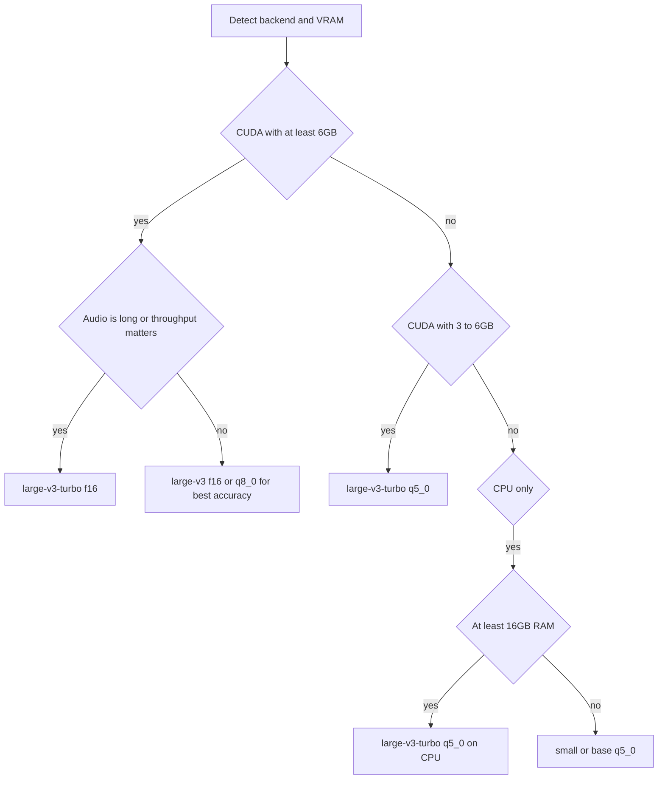

# Plan: choose a model that is fast on GPU and still accurate

## Goal

Answer whether a different whisper model gives GPU speed **without** losing
accuracy — and if so, change the selection logic so the toolchain picks it
automatically. This is the highest-value, lowest-risk option of the three
considered, because it needs no new engine and no new dependency.

## The first finding: on a good GPU this may already be happening

[`Get-RecommendedModel()`](scripts/setup-worker.ps1:333) already returns
`large-v3-turbo` whenever CUDA is present and VRAM is >= 8 GB:

```powershell
if ($Hw.backend -eq 'cuda' -and $Hw.vramMb) {
    if ($Hw.vramMb -ge 8000) { return 'large-v3-turbo' }
    if ($Hw.vramMb -ge 4000) { return 'medium' }
    return 'small'
}
```

`large-v3-turbo` is precisely the model the question is looking for: the
large-v3 encoder with a 4-layer decoder instead of 32, so roughly an 8x cheaper
decoder at near-large-v3 accuracy.

**Therefore the diagnostic question comes first:** if transcription is slow on a
machine whose `env.json` already records `model.name = ggml-large-v3-turbo.bin`,
then the model is *not* the bottleneck and no model change will help. The cause
is almost certainly one of the issues already found:

- the silent CPU fallback at [`zoombie.ps1:405`](scripts/zoombie.ps1:405), which
  means a machine configured for `cuda` actually ran on CPU;
- flash attention never passed ([`zoombie.ps1:377`](scripts/zoombie.ps1:377));
- no thread count on the CPU path.

Checking `env.json` for `model.name` and `whisper.backend` before changing
anything is step one of this plan.

## Candidate models, assessed

| Model | Params / file | GPU speed | Accuracy | Notes |
|-------|---------------|-----------|----------|-------|
| `large-v3` | ~1.55 B, ~3.1 GB f16 | slowest (32-layer decoder) | gold standard, best multilingual | the accuracy reference everything is measured against |
| `large-v3-turbo` | ~809 M, ~1.6 GB f16 | fast (4-layer decoder) | near large-v3, small regression | the intended answer to this question |
| `large-v3-turbo` q5_0 | ~574 MB | fast, less VRAM, slightly slower decode than f16 | close to f16 turbo | lets a golden-class model fit a 4-6 GB card |
| `medium` | ~769 M, ~1.5 GB | moderate | clear drop from large | currently chosen for 4-8 GB VRAM |
| `distil-large-v3` | distilled | fast | effectively English-focused | **not suitable** for Russian/Cyrillic content |

Two caveats that matter for this repo specifically:

1. **turbo is weaker on non-English.** OpenAI documents that the turbo decoder
   degrades on languages other than English, with a higher tendency to repeat or
   hallucinate. Russian is a likely language for this toolchain, so turbo must
   be validated on a Russian sample before being made the accuracy default, and
   `large-v3` should remain selectable when accuracy is paramount.
2. **turbo's speed advantage grows with audio length.** The encoder is unchanged
   from large-v3 and dominates on short clips, so the payoff is small on a
   30-second file and large on a 30-minute one. Benchmarks on the synthetic
   pangram in [`selftest.ps1`](scripts/selftest.ps1:93) will show almost nothing
   and must not be used to judge this.

## What is wrong with the current logic

The recommendation is **one-dimensional**: it picks a model *size* and never
considers quantization. That leaves real performance on the table:

- 4-8 GB VRAM currently yields `medium`. A `large-v3-turbo-q5_0` fits in that
  budget and is both faster and more accurate than `medium`.
- Unquantized f16 is always downloaded, so load time and VRAM stay high even
  where a quantized variant would be indistinguishable in output.
- It keys only on VRAM and RAM, not on the actual quantization-aware fit.

Good news: **no new plumbing is needed to try this now.** `-Model` already
exists on both sides — [`setup-worker.ps1:60`](scripts/setup-worker.ps1:60) and
[`zoombie.ps1:93`](scripts/zoombie.ps1:93) — and
[`Install-WhisperModel()`](scripts/setup-worker.ps1:559) prefixes `ggml-` and
appends `.bin`, so both of these already work today:

```powershell
# near-gold, fast: the model the question is asking for
powershell -NoProfile -ExecutionPolicy Bypass -File scripts\setup-worker.ps1 -Model large-v3-turbo

# golden-class model that fits a small card
powershell -NoProfile -ExecutionPolicy Bypass -File scripts\setup-worker.ps1 -Model large-v3-turbo-q5_0
```

So the immediate action is a test, not a code change. The code change is to make
the *automatic* choice match this.

## Proposed selection logic



The intent: a golden-class model whenever the hardware can hold one, with
quantization used to fit it rather than dropping to a weaker model.

## Changes by file

1. [`scripts/setup-worker.ps1`](scripts/setup-worker.ps1)
   - Replace [`Get-RecommendedModel()`](scripts/setup-worker.ps1:325) with a
     quantization-aware chooser that returns both a model name **and** a variant,
     and computes a VRAM budget (encoder + decoder + KV cache + working set)
     rather than comparing raw VRAM to fixed thresholds.
   - Stop treating `medium` as the 4-8 GB answer; prefer
     `large-v3-turbo-q5_0` there.
   - Keep the f16 variant when the card has ample headroom, since f16 decodes
     slightly faster than q5_0 on GPU.
   - Record `model.name`, `model.quant` and `model.chosenReason` in env.json so a
     slow run can be explained after the fact.
   - Add a `-Language` hint path: when the user's content is Russian, note in the
     report that `large-v3` is the accuracy ceiling and that turbo trades a small
     amount of accuracy for speed.
2. [`scripts/zoombie.ps1`](scripts/zoombie.ps1)
   - `doctor`: report the installed model name, quantization, file size, and
     whether it fits the detected VRAM.
   - Consider a `-Preset fast|accurate` convenience that maps to a model and
     variant, so the user does not have to know model names.
3. [`README.md`](README.md) and [`setup.md`](setup.md)
   - Document the model matrix, the turbo trade-off, the one-line `-Model`
     overrides, and guidance that model choice only matters once the backend is
     proven to be GPU.
4. [`scripts/lib/ZoombieEnv.psm1`](scripts/lib/ZoombieEnv.psm1:26) — bump
   `cvrm-zoombie-version` if any skill text changes.

## Verification

- **Diagnose first:** read `env.json` `model.name` and `whisper.backend`. If the
  model is already `large-v3-turbo` and the backend says `cuda`, the slowness is
  the silent CPU fallback, not the model — confirm with the instrumentation from
  [`plans/zoombie-transcription-performance.md`](plans/zoombie-transcription-performance.md)
  before touching model selection.
- **Compare on real audio**, not the pangram: a 10-30 minute real recording with
  speech and silence, same file for every model.
- Fill this table by measurement:

| Model | Device | Size on disk | RTF | WER vs large-v3 reference | Verdict |
|-------|--------|--------------|-----|---------------------------|---------|
| large-v3 f16 | cuda | | | reference | |
| large-v3-turbo f16 | cuda | | | | |
| large-v3-turbo q5_0 | cuda | | | | |
| large-v3-turbo q5_0 | cpu | | | | |

- **Validate on Russian**, since that is where turbo's reported regression would
  show, and this repo is Cyrillic-focused.
- Confirm the exact quantized filename exists before hard-coding it. The
  HuggingFace filename for the quantized turbo variant must be verified against
  `ggerganov/whisper.cpp` at implementation time; the download URL is built in
  [`Install-WhisperModel()`](scripts/setup-worker.ps1:567) and a wrong filename
  fails as a small-file error at
  [`setup-worker.ps1:575`](scripts/setup-worker.ps1:575).

## Open questions for the user

1. What does the installed `env.json` say for `model.name` and
   `whisper.backend`? This determines whether a model change can help at all.
2. Is the primary content language Russian? That decides how far turbo can be
   pushed by default.
3. Which GPU is on the target machine? VRAM size alone changes the recommended
   model and whether quantization is needed.
4. Is a small accuracy regression acceptable in exchange for speed, or should
   `large-v3` remain the default whenever the card can hold it?
