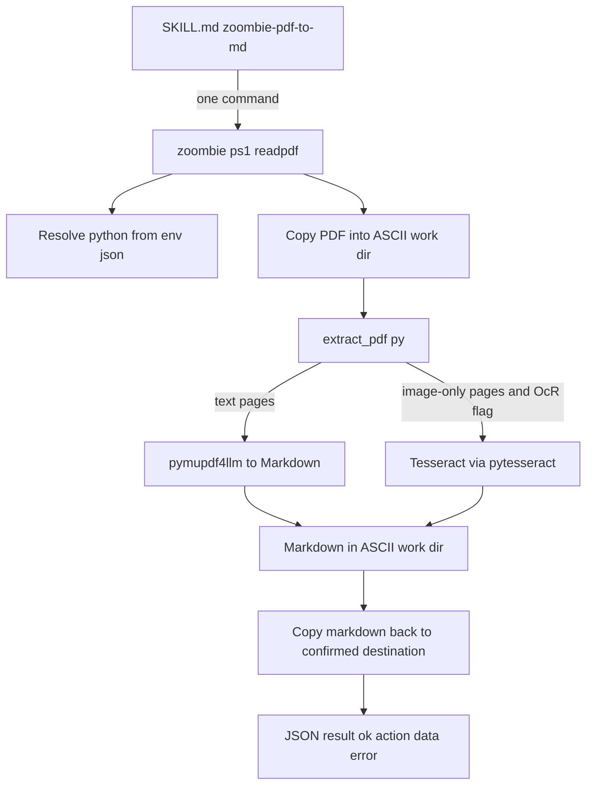

# Plan: add the `zoombie-pdf-to-md` skill (PDF -> Markdown)

## Goal

Add a fifth skill, `zoombie-pdf-to-md`, that converts a PDF into Markdown using
**PyMuPDF4LLM**, with an **optional Tesseract OCR fallback** for scanned /
image-only pages. It must follow the house pattern exactly: a thin `SKILL.md`
that only inspects the project, proposes paths, confirms with the user, and then
calls **one** deterministic CLI command. No fragile flags re-improvised per run.

## Design decisions (confirmed with the user)

| Decision | Choice |
|----------|--------|
| Engine | PyMuPDF4LLM (`pymupdf4llm`) for text-based PDFs |
| Scanned PDFs | Optional Tesseract OCR fallback via `pytesseract`, opt-in per run with `-Ocr` |
| Python | Reuse the Python this repo already requires (no second interpreter) |
| Dependencies | `pip install --user` into that interpreter's user site-packages |
| PATH | Never rely on PATH: resolve `python.exe` via env.json, then bin dirs, then `Get-Command` |
| ASCII safety | Reuse [`Copy-ZoombieIntoSafeWork()`](scripts/lib/ZoombieEnv.psm1:373) so the Python tool never sees a Cyrillic path |

Rationale: PyMuPDF4LLM emits real Markdown (headings, lists, tables, bold) and
has no model download. Tesseract stays optional, so a machine with text PDFs
needs no extra system dependency. Python remains a *fallback* dependency: if it
is absent, setup and the CLI both report a clear, actionable message instead of
failing obscurely.

## Command surface

The skill calls exactly one CLI command:

```powershell
& $cli readpdf -Source "<pdf>" -Output "<confirmed-basename>" [-Ocr] [-Images] [-Pages 1-5] [-Force]
```

It prints one JSON line; read `data.output`, `data.pages`, `data.ocrUsed`.

The Python helper is called only by the CLI, never by the skill:

```
python extract_pdf.py --input <ascii-pdf> --output <ascii-md> [--ocr] [--images <dir>] [--pages 1-5] [--json]
```

## Architecture



## Files

### New

1. `scripts/pdf/extract_pdf.py` — the deterministic extractor.
   - `--input`, `--output`, optional `--ocr`, `--images <dir>`, `--pages`, `--json`.
   - Uses `pymupdf4llm.to_markdown()`; with `--ocr`, rasterizes pages that
     contain no extractable text and runs Tesseract. Emits one JSON line when
     `--json` is passed.
   - Exits non-zero with a clear message when OCR is requested but Tesseract is
     missing, so the CLI can surface a precise error.
2. `scripts/requirements-pdf.txt` — `pymupdf4llm`, `pymupdf`, `pytesseract`.
3. `skills/zoombie-pdf-to-md/SKILL.md` — thin wrapper. Front matter with
   `name: zoombie-pdf-to-md` and the bumped `cvrm-zoombie-version`. Procedure:
   resolve the CLI by probing both roots, inspect the project, find the PDF(s),
   propose 2-4 destination basenames, ask whether to use OCR and whether to
   extract images, confirm, run `readpdf`, report every artifact with size.

### Modified

4. `scripts/zoombie.ps1`
   - Add `readpdf` to the `[ValidateSet(...)]` on `-Command` and to the dispatch
     `switch`.
   - Add switch/params `-Ocr`, `-Images`, and a `-Pages` string.
   - New `Invoke-ReadPdf` function mirroring [`Invoke-Extract()`](scripts/zoombie.ps1:261):
     resolve the Python interpreter, assert the script exists, copy the input into
     an ASCII work dir, run the helper, copy the `.md` (and optional images) back to
     the confirmed destination, honour `-DryRun`/`-Force`, and emit the JSON
     result. Reuse the `$ErrorActionPreference = 'Continue'` native-call pattern.
   - Update the `.SYNOPSIS`/`.PARAMETER` help block.

5. `scripts/setup-worker.ps1`
   - New `Install-PdfToolchain`: `pip install --user --no-warn-script-location -r`
     `requirements-pdf.txt` into the existing Python, then probe the imports.
     Idempotent (pip no-ops when satisfied), honouring `-Check`/`-DryRun`/
     `-Force`, following the shape of [`Install-YtDlp()`](scripts/setup-worker.ps1:378).
   - Extend [`Install-ZoombieCli()`](scripts/setup-worker.ps1:520) to also copy
     the `pdf\` folder, so the installed CLI carries its helper.
   - Add the new skill to the per-file fallback list at
     [`setup-worker.ps1:170`](scripts/setup-worker.ps1:170).
   - Detect Tesseract and report it as optional; when absent, note the install
     hint rather than silently failing later.
   - Add a `pdf` section to the manifest (`python`, `ok`, `tesseract`) and report
     PDF tooling in the `missing` list only in `-Check` mode (it is optional).
   - Call it in the main flow near steps 6b, before the manifest is written.

6. `scripts/lib/ZoombieEnv.psm1`
   - Bump `$script:ZoombieSkillVersion` from `3.0.0` to `3.1.0` so the deploy
     step reports `updated` for the new and changed skills.
   - Add a `Get-ZoombiePdfPython` helper that resolves the interpreter (env.json
     `python.path`, then bin dirs, then `Get-Command`), keeping path rules in the
     shared module.

7. `scripts/selftest.ps1`
   - Add a step that synthesizes a small PDF (e.g. via a tiny Word/PDF write or
     `pymupdf` itself) into the existing Cyrillic scratch dir and runs `readpdf`,
     asserting the Markdown is non-empty. Keep it skippable when the PDF
     toolchain is not installed.

8. `README.md` and `setup.md`
   - Update the layout table, the CLI command list, and every place that says
     **four skills** / lists the skill names, to include `zoombie-pdf-to-md` and
     version `3.1.0`.
   - Add `readpdf` to the CLI quick-reference and the final checklist.

## Skill content notes

- Front matter `description` must state: convert a PDF to Markdown, use for
  "extract text from this PDF", "convert PDF to markdown", "read this PDF";
  inspect the project, propose output paths, and confirm before writing.
- Procedure mirrors the other skills: resolve the CLI (probe both roots, with
  the repo fallback), inspect the project for `docs/`, `pdf/`, `output/`,
  propose 2-4 concrete basenames, ask about OCR and images, confirm, run
  `readpdf`, then report each artifact's path and size.
- Notes must mention: OCR is opt-in and needs Tesseract; never overwrite without
  consent; the `cmd.exe` wrapper fallback.

## Verification

- `scripts\setup-worker.ps1 -Check` reports the PDF toolchain state without
  writing anything.
- `scripts\setup-worker.ps1` installs the dependencies + helper and records the manifest.
- `& $cli readpdf -Source <pdf> -Output <basename>` produces the `.md` and the
  expected JSON.
- `scripts\selftest.ps1` still passes, including the Cyrillic-path regression.
