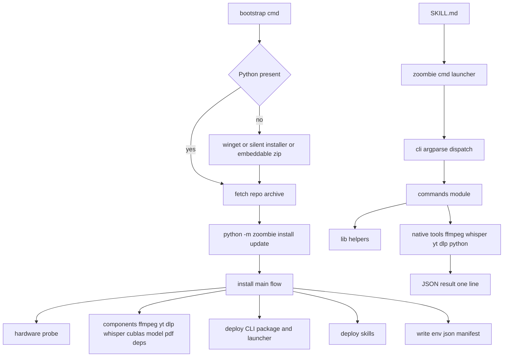
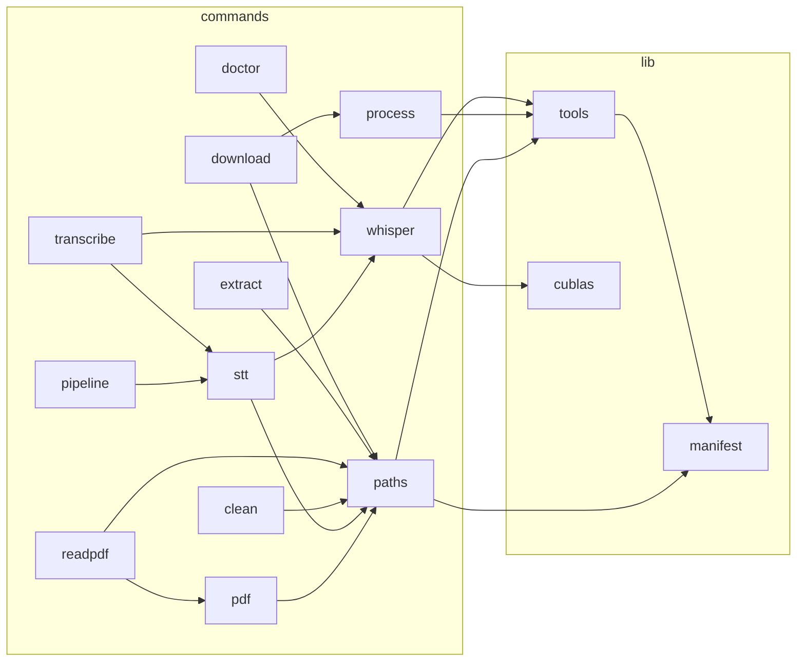

# Plan: convert the zoombie toolchain from PowerShell to Python

## Implementation findings (bugs the port surfaced)

Recorded as they were found, because each one is a behaviour change a reader
would otherwise have to rediscover:

- **`refresh_path_from_registry` must MERGE, not rebuild.** The PowerShell
  original replaced `$env:Path` with the Machine + User registry values. But
  `System32` is injected by the OS and stored in NEITHER registry value, so
  replacing DROPS it. That silently broke `nvidia-smi` resolution
  (`C:\Windows\System32\nvidia-smi.exe`) and therefore GPU detection on a machine
  with an RTX 3080. The Python version merges registry entries with the existing
  PATH and de-duplicates, and additionally probes fixed system directories as a
  last resort.
- **`display_adapters` uses `EnumDisplayDevicesW`, not DXGI.** A DXGI
  implementation was written first and discarded: its adapter interfaces are COM
  objects reachable only through hand-computed vtable offsets, which is
  unreadable and unverifiable without the exact interface version present.
  `EnumDisplayDevicesW` is documented, needs no COM interface and no index limit,
  and was verified on the target machine.
- **Enumeration must strip the extended prefix.** `os.DirEntry.path` inherits the
  `\\?\` prefix when scanning a prefixed path, which then leaks into JSON results
  and into paths handed to native tools. The Python version builds entry paths
  from the caller's own directory instead. Caught by a unit test, and it is the
  same class of bug the PowerShell `ConvertFrom-ZoombieLongPath` existed to fix.
- **`is_ascii("")` is not a reason to reject an empty path**, but `path_length`
  must still return 0 rather than measuring the CWD for an empty string.

## Goal

## Goal

Replace the PowerShell implementation (`lib/ZoombieEnv.psm1`, `zoombie.ps1`,
`setup-worker.ps1`, `setup.ps1`, `selftest.ps1`) with a single Python codebase
that keeps a shared helper library, preserves the CLI's external contract, and
**does not re-implement PowerShell-only workarounds** that Python does not need.

Two premises drive this:

1. **PowerShell is a poor generation target.** Verb-Noun casing rules, approved
   verbs, `Set-StrictMode` member-access traps, `$Input` being reserved,
   `ValidateSet`, hashtable vs `PSCustomObject`, `-DisableNameChecking`, native
   stderr becoming a terminating error under `ErrorActionPreference='Stop'`, and
   `Start-Process` exit-code quirks are all host noise that consumes generation
   budget and creates failure modes that have nothing to do with the task.
2. **One shared blob is hard for an agent to use.** A ~1860-line module plus a
   ~1270-line CLI means every skill's path runs through the same undifferentiated
   code. The Python port splits it by concern, so a skill's path
   (`cli -> commands/<name>.py -> lib/<concern>.py`) is short and legible.

## Scope decision (confirmed with the user)

Convert **everything** to Python: installer, runtime CLI, self-test. Keep **one**
minimal bootstrap script whose only job is to ensure a Python interpreter exists
and then hand off to the Python installer.

### Follow-up: the PowerShell entry point is a shim, not a second bootstrap

The "one bootstrap" rule was later relaxed by exactly one file, and only for
distribution ergonomics. [`scripts/bootstrap.ps1`](scripts/bootstrap.ps1:1) exists
so a fresh machine needs a single PowerShell line
(`irm <raw>/scripts/bootstrap.ps1 | iex`) instead of saving a `.cmd` by hand. It
holds **no install logic**: it downloads [`bootstrap.cmd`](scripts/bootstrap.cmd:1)
to a temp dir and runs it, so the rule above still holds in the sense that matters
— there is one implementation of "ensure Python, fetch the repo, hand off", and
nothing about it can drift into a second dialect. `tests/test_bootstrap.py` pins
the agreement (same repo slug and ref, same options) and the restraint (no
execution-policy change, no `setx`, no `$PROFILE` edit, no location dependency).

The `install/update.py` module that this plan proposed as the `setup.ps1`
replacement was never called by anything and has been deleted; the fetch step
lives in `bootstrap.cmd`, which always pulls the current archive and runs the
installer from that fresh checkout.

## Feasibility: the shared library is not just feasible, it is the point

Almost every function in [`ZoombieEnv.psm1`](scripts/lib/ZoombieEnv.psm1:1) has a
direct Python equivalent, and the total shrinks substantially because the
defensive layer exists only to satisfy PowerShell.

### Domain helpers that carry over

| PowerShell | Python | Notes |
|---|---|---|
| `Get-ZoombieEnvRoot` | `lib/paths.py: get_env_root` | same candidate order, same `ZOOMBIE_ENV_ROOT` override |
| `Test-ZoombieAsciiPath` | `lib/paths.py: is_ascii_path` | `str.isascii()` replaces the char loop |
| `Get-ZoombieEnvManifest` / `Save-ZoombieEnvManifest` | `lib/manifest.py: load/save` | `json` with `encoding=utf-8` and no BOM by default |
| `Resolve-ZoombieTool` / `Get-ZoombiePython` | `lib/tools.py: resolve_tool / find_python` | manifest lookup then bin dirs then PATH |
| `Get-ZoombieToolVersion` | `lib/tools.py: tool_version` | `subprocess.run(capture_output=True)` |
| `Update-ZoombiePath` | `lib/tools.py: refresh_path_from_registry` | `winreg` read of Machine + User Path |
| `Test-ZoombieWindowsStoreStub` | `lib/tools.py: is_store_stub` | unchanged substring rule |
| `Get-ZoombiePipShimSnapshot` / `Remove-ZoombieNewPipShims` | `lib/tools.py` | same before/after snapshot semantics |
| `Copy-ZoombieIntoSafeWork` | `lib/paths.py: copy_into_safe_work` | the whisper ASCII invariant |
| `Assert-ZoombiePathFits` / `Get-ZoombiePathBudget` | `lib/paths.py: assert_path_fits / PATH_BUDGET` | still pure string math |
| `Get-ZoombieCublasProvision` and friends | `lib/cublas.py` | the pinned redist table + sha256 verification |
| `Get-ZoombieWhisperCudaRuntime` | `lib/whisper.py: cuda_runtime` | same three distinct states |
| `Read-ZoombieWhisperLog` | `lib/whisper.py: read_whisper_log` | Python decodes by BOM far more simply |
| `Get-ZoombieWhisperDeviceInfo` | `lib/whisper.py: device_info` | same ordered signals, same Selected vs Initialised split |
| `Get-ZoombieWhisperTimings` | `lib/whisper.py: timings` | regex parse, float conversion |
| `Test-ZoombieWhisperGpuFailure` | `lib/whisper.py: looks_like_gpu_failure` | same signature list |
| `Invoke-ZoombieWhisperBackendProbe` | `lib/whisper.py: backend_probe` | `--help` probe |
| `Get-ZoombieWhisperCapabilities` | `lib/whisper.py: capabilities` | same per-exe cache, same flag regexes |
| `Get-ZoombieSkillMarker` / version | `lib/skills.py` | keep the `cvrm-zoombie-version` contract |
| `Write-ZoombieResult` / `Write-ZoombieLog` | `lib/process.py: write_result / log` | identical JSON envelope, logs on stderr |
| `Get-CpuThreadCount` | `lib/process.py: cpu_threads` | `os.cpu_count()` |
| `Get-HardwareProfile` / `Get-RecommendedModel` | `install/hardware.py` | see the GPU-detection risk below |
| `Install-*` functions | `install/components.py` | ffmpeg, yt-dlp, whisper asset, model, PDF deps, skills |

### PowerShell quirks that are RETIRED, not ported

These exist only because the host is PowerShell. Re-implementing them in Python
would be pure cargo cult, and each one is a bug surface that disappears:

| Quirk today | Why it exists | Py outcome |
|---|---|---|
| `Get-ManifestValue`, `Get-Field` dotted-path walkers | member access throws under `Set-StrictMode -Version Latest` | `dict.get` chains; **deleted** |
| `Test-ZoombieLongPathEnabled` reporting | `powershell.exe` 5.1 is not `longPathAware`, so the registry policy is ignored | managed IO uses the `\\?\` prefix where a path is long; policy check becomes a single diagnostic line |
| `ConvertFrom-ZoombieLongPath` applied to every enumeration result | `?` is a wildcard in PS cmdlets, so a prefixed path breaks `Join-Path`/`Copy-Item` | `os`/`shutil` take the prefixed path fine; **deleted** |
| `Get-QuotedWhisperArguments` | `Start-Process` joins argv with spaces and does not quote | list argv; **deleted** |
| `ExitCode` as a possibly-empty string, `ExitCodeUnknown` | PS 5.1 returns an empty `ExitCode` with redirected streams | `Popen.returncode` is always an `int`; **deleted** |
| `Remove-ZoombieWorkDir` background `Start-Job` with a timeout | `Remove-Item -Recurse` can block forever on a locked file | `shutil.rmtree(onerror=...)`; failure is immediate and the dir is left behind; **simplified** |
| `Expand-ZoombieArchive` per-entry `System.IO.Compression` | `Expand-Archive` validates assembled paths and throws IOException | `zipfile`; long destinations still get the prefix |
| `$ErrorActionPreference` save/restore around every native call | native stderr becomes terminating under `Stop` | not applicable; **deleted** |
| `PYTHONUTF8=1` toggling | PS code-page inheritance for the child | explicit `encoding` on every read/write; **deleted** |
| `-DisableNameChecking`, `#Requires -Version 5.1`, `ValidateSet`, `$Input` avoidance, `[ordered]@{}`, `PSObject.Properties` | PS host constraints | **not applicable** |
| Unit conversion quirks (`/ 1GB`, `/ 1MB`) | PS literals | plain arithmetic |

### Invariants that are REAL and must survive verbatim

These are not host quirks; they encode hard-won fixes. Every one is preserved.

1. **ASCII work-dir isolation** for `whisper-cli`, PyMuPDF and Tesseract: copy
   input into an ASCII scratch dir, run the native tool there, copy artifacts
   back to the possibly-Cyrillic destination.
2. **Path budget check** (240 chars + per-call slack) for any path handed to a
   native tool, refused up front with the real cause.
3. **One JSON line on stdout**; all human output on stderr; exit 0/1.
4. **GPU proved, not assumed**: device must be *selected* for a real run;
   `backend_initialised` alone is capability, reported separately.
5. **A CPU run on a GPU-configured machine is a failure**, with
   `-NoGpu` / `-AllowCpuFallback` / `-StrictGpu` as the escape hatches.
6. **cuBLAS provisioning** keyed off the asset's CUDA major, sha256 verified
   before any DLL is placed beside `whisper-cli.exe`.
7. **whisper exit-hang tolerance**: completion is detected from whisper's own
   `whisper_print_timings` output, not from process exit.
8. **Narrow GPU retry**: only retry on the CPU when the failure looks like a GPU
   failure; separate logs per attempt.
9. **`cvrm-zoombie-version` skill marker** so deployment can report
   `up to date` vs `updated`.
10. **The backend follows current hardware**, never a sticky `env.json` value.

## Naming: drop the Verb-Noun-Redundant prefix entirely

The PowerShell names are the worst part of the codebase to read and to generate:
`ConvertFrom-ZoombieLongPath`, `Assert-ZoombiePathFits`,
`Get-ZoombieWhisperDeviceInfo`, `Invoke-ZoombieWhisperBackendProbe`. Every one
repeats the project name (a Python module path already namespaces it), every one
carries a PowerShell verb that Python does not need, and the verbs are chosen to
satisfy approved-verb rules rather than to mean anything.

Python rules for this port:

- **No `Zoombie` in any symbol.** The package is `zoombie`; `zoombie.paths.to_extended`
  is already unambiguous.
- **No Verb-Noun.** A function is `verb_noun` only when it *does* something
  (`copy_into_safe_work`, `assert_path_fits`, `download_file`). A pure transform
  is just `to_extended` / `from_extended`, not `ConvertTo-ZoombieLongPath`.
- **Queries are a predicate or a plain noun.** `is_ascii_path` (not
  `Test-ZoombieAsciiPath`), `path_length`, `cuda_runtime`, `device_info`,
  `timings`, `capabilities` (not `Get-ZoombieWhisperCapabilities`).
- **Actions are imperative, short, no `Invoke-`/`Get-`/`New-` filler.** `run_whisper`,
  `probe_backend`, `install_whisper`, `load_manifest`, `save_manifest`.
- **One module per concern, so the module name carries the context** and the
  function name stays short: `whisper.device_info` beats
  `Get-ZoombieWhisperDeviceInfo`.
- **Constants are UPPER_SNAKE**: `PATH_BUDGET`, `SKILL_VERSION`, `MARKER_KEY`.

Rename map for the sharpest offenders:

| PowerShell | Python |
|---|---|
| `ConvertTo-ZoombieLongPath` | `paths.to_extended` |
| `ConvertFrom-ZoombieLongPath` | `paths.from_extended` |
| `Get-ZoombieAbsolutePath` | `paths.absolute` |
| `Test-ZoombiePath` | `paths.exists` / `paths.is_file` / `paths.is_dir` |
| `New-ZoombieDirectory` | `paths.ensure_dir` |
| `Remove-ZoombiePath` | `paths.remove` |
| `Copy-ZoombieIntoSafeWork` | `paths.copy_into_safe_work` |
| `Assert-ZoombiePathFits` | `paths.assert_fits` |
| `Get-ZoombiePathBudget` | `paths.PATH_BUDGET` |
| `Test-ZoombieAsciiPath` | `paths.is_ascii` |
| `Read-ZoombieWhisperLog` | `whisper.read_log` |
| `Get-ZoombieWhisperDeviceInfo` | `whisper.device_info` |
| `Get-ZoombieWhisperTimings` | `whisper.timings` |
| `Get-ZoombieWhisperCapabilities` | `whisper.capabilities` |
| `Invoke-ZoombieWhisperBackendProbe` | `whisper.probe_backend` |
| `Test-ZoombieWhisperGpuFailure` | `whisper.looks_like_gpu_failure` |
| `Remove-ZoombieWorkDir` | `paths.remove_work_dir` |
| `Get-ZoombieWhisperCudaRuntime` | `cublas.runtime_status` |
| `Get-ZoombieCublasProvision` | `cublas.provision_spec` |
| `Get-ZoombieCudaMajorFromAssetName` | `cublas.major_from_asset_name` |
| `Write-ZoombieResult` | `process.write_result` |
| `Write-ZoombieLog` | `process.log` |
| `Get-ZoombieToolVersion` | `tools.tool_version` |
| `Resolve-ZoombieTool` | `tools.resolve` |
| `Get-ZoombiePython` | `tools.find_python` |
| `Get-ZoombiePipShimSnapshot` | `tools.pip_shim_snapshot` |
| `Remove-ZoombieNewPipShims` | `tools.remove_new_pip_shims` |
| `Get-ZoombieSkillMarker` | `skills.read_marker` |
| `Get-ZoombieEnvRoot` | `paths.env_root` |
| `Get-ZoombieEnvPath` | `paths.env_path` |
| `Get-ZoombieEnvManifest` | `manifest.load` |
| `Save-ZoombieEnvManifest` | `manifest.save` |
| `Get-HardwareProfile` | `hardware.profile` |
| `Get-RecommendedModel` | `hardware.recommend_model` |
| `Install-WhisperModel` | `components.install_model` |
| `Select-WhisperAsset` | `components.select_asset` |
| `Install-CublasRuntime` | `components.install_cublas` |
| `Get-ZoombieCpuThreadCount` | `process.cpu_threads` |
| `Expand-ZoombieArchive` | `archive.extract_zip` |

## Target layout

```
scripts/
  bootstrap.cmd                     ONE bootstrap: ensure Python, fetch repo, hand off
  requirements-pdf.txt              unchanged
  requirements-selftest.txt         NEW pyttsx3 for the self-test TTS step
  zoombie/
    __init__.py                     version constants (SKILL_VERSION, MARKER_KEY)
    __main__.py                     python -m zoombie -> cli.main()
    cli.py                          argparse + dispatch + one-JSON envelope
    commands/
      doctor.py  download.py  extract.py  readpdf.py
      transcribe.py  pipeline.py  clean.py
    lib/
      paths.py      env root, ASCII guard, path budget, extended prefix, safe-work copy
      manifest.py   env.json read/write
      tools.py      tool resolution, PATH refresh, python discovery, pip shims, versions
      process.py    subprocess helpers, logging, JSON result, cpu threads
      whisper.py    capabilities, device info, timings, gpu failure, hang-tolerant runner
      cublas.py     pinned redist records + runtime readiness
      skills.py     skill marker read + deploy
      stt.py        shared transcribe orchestration used by transcribe and pipeline
      pdf.py        imported PDF converter API refactored out of pdf/extract_pdf.py
    install/
      main.py       installer flow (replaces setup-worker.ps1 main)
      hardware.py   hardware probe + model recommendation
      components.py ffmpeg, yt-dlp, whisper asset, model, PDF deps, skills, CLI deploy
      update.py     thin fetch-latest-and-run entry (replaces setup.ps1)
    selftest.py     end-to-end test (replaces selftest.ps1)
  pdf/extract_pdf.py                kept as a thin standalone wrapper over lib/pdf.py
tests/
  test_paths.py  test_whisper.py  test_cublas.py  test_pdf.py
```

Installed layout mirrors today's shape, so relative discovery still works:

```
%USERPROFILE%\zoombie-env\
  bin\ffmpeg.exe, ffprobe.exe
  bin\whisper\whisper-cli.exe (+ ggml/cuBLAS DLLs)
  bin\zoombie\zoombie.cmd                 stable launcher: PYTHONPATH=<dir> + python -m zoombie
  bin\zoombie\zoombie\...                 the package (lib, commands, install)
  bin\zoombie\requirements-pdf.txt
  models\ggml-*.bin
  work\<guid>\   tmp\   src\   env.json
```

## Execution contract (unchanged where it matters)

The JSON envelope is byte-compatible so no caller has to change parsing:

```
{ "ok": <bool>, "action": "<name>", "error": <string|null>, "data": {...}, "timestamp": "<iso8601>" }
```

Field names inside `data` stay as documented today: `artifacts.txt.path`,
`artifacts.srt.path`, `deviceUsed`, `deviceVerified`, `backendInitialised`,
`gpuCapable`, `gpuRequired`, `realtimeFactor`, `audioDurationSec`, `loadMs`,
`totalMs`, `fallbackReason`, `silentCpuFallback`, `gpuAttemptWallMs`,
`whisperExitHang`, `logPath`, `pages`, `ocrUsed`, `keptScannedPages`,
`missing`, `manifest`, `gpuPolicy`, `changes`.

Invocation moves from `& $cli <command>` to a stable shim, so skills keep a
single, launcher-based call:

```
& "<root>\bin\zoombie\zoombie.cmd" transcribe -Source <audio> -Output <base> -Srt
```

Parameter names are preserved exactly, including `-Source` (which exists because
PowerShell reserves `$Input`) — keeping it avoids churning five skills, two docs
and every example for no benefit. Python's `argparse` accepts the same
single-dash long options via `prefix_chars='-'` configured as needed, so the
documented command forms continue to work.

## Architecture



### Shared-library decomposition



## The installer: what changes beyond syntax

- **No `lib/` import of a `.psm1`.** `install/main.py` imports the same package
  the CLI uses, so installer and runtime share one implementation of paths,
  manifest and whisper logic rather than two drifting copies.
- **Repo self-refresh** replaces the archive-then-per-file fallback: fetch the
  codeload zip once and extract; retry per-file only if the archive fails.
  `setup.ps1`'s "always fetch the latest worker" behaviour moves to
  `install/update.py`, which bootstraps `sys.path` so the package is importable
  from the extracted tree.
- **PDF dependencies**: [`requirements-pdf.txt`](scripts/requirements-pdf.txt) has
  a header claiming an isolated venv at `<root>\bin\pdf\venv`, while the code
  installs with `pip --user` into the shared interpreter. This plan resolves the
  contradiction in favour of `--user` (matching actual behaviour) and corrects
  the comment, or moves to the venv deliberately — the header must not keep
  describing something the code does not do.
- **GPU detection** cannot use `Get-CimInstance`. Recommended order:
  `nvidia-smi` (CUDA + VRAM + driver, the values that actually matter) →
  DXGI adapter enumeration through `ctypes` (detects a display adapter, so
  `vulkan` vs `cpu`) → registry CPU name and `GlobalMemoryStatusEx` for RAM.
  `wmic` is avoided (removed on recent Windows) and PowerShell is not called.

## Risks and how the plan handles them

| Risk | Handling |
|---|---|
| **Self-test TTS.** `System.Speech` has no Python equivalent; the content assertion needs real speech. | Use `pyttsx3` (SAPI5 under the hood) from `requirements-selftest.txt`. If unavailable, the step degrades to a reported skip, matching how `readpdf` already skips — the Cyrillic regression is still exercised on the synthesized WAV path via `extract` |
| **Long paths on Python.** `python.exe` is not `longPathAware` on all installs. | Keep one `to_extended_path()` helper for managed IO and keep `assert_path_fits` for native tool paths. No per-call prefix/unprefix dance needed |
| **Bootstrap is a new single point of failure.** | Existing Python first; then `winget`; then a silent per-user installer; then the embeddable zip plus `get-pip.py`. Archive fetch uses `curl.exe` and `tar.exe` (present since Windows 10 1803) |
| **Contract drift breaks five skills and two docs.** | Freeze the JSON field list and parameter names; port one command at a time and diff the JSON against the PowerShell output for the same inputs |
| **Installer regression loses a machine-local install.** | Keep the pinned cuBLAS table, the sha256 verification, the skill marker version, and the `-Check`/`-DryRun`/`-Force` semantics exactly |

## Verification strategy

- **Parity harness.** For `doctor` and `readpdf`, run the PowerShell CLI and the
  Python CLI on the same input and diff the JSON keys; the whole field contract
  must be identical.
- **Ordered port.** `lib` first with unit tests, then read-only commands
  (`doctor`, `clean`), then `extract`, then `transcribe`/`pipeline`, then
  `readpdf`, then the installer, then the self-test.
- **Native-tool checks without a GPU**: `-NoGpu` transcribe must report
  `deviceUsed: cpu`, `silentCpuFallback: false`, and a real transcript.
- **Cyrillic regression** must keep passing, written into a Cyrillic scratch dir.
- **Path budget**: construct an over-long destination and assert the named
  refusal, not a raw `OSError`.
- **Installer dry run**: `-Check` and `-DryRun` must write nothing.

## Cleanup

Delete `lib/ZoombieEnv.psm1`, `zoombie.ps1`, `setup.ps1`, `setup-worker.ps1` and
`selftest.ps1` only after the port is verified end to end. Update
`cvrm-zoombie-version` (to `4.0.0`) so deployed skills are reported as `updated`.
