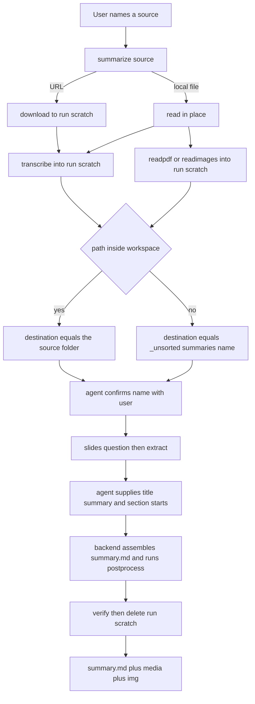

# Plan: one skill, stepwise summarize MCP flow, visible img, no .data

Status: **plan** (nothing implemented). Supersedes the folder-choice and item-layout
guidance in [`skills/zoombie-summarize/SKILL.md`](../skills/zoombie-summarize/SKILL.md:175)
and the `.data/` layout in [`plans/zoombie-item-model.md`](zoombie-item-model.md:1).

## Decisions (confirmed by the user)

1. **One skill only.** `zoombie-summarize`. `download`, `extract`, `transcribe`,
   `readpdf`, `readimages` become MCP-only tools. A bare "download this link" is the
   `download` tool alone; "summarize this link" runs the summarize flow, which
   downloads internally. Summarize is never advertised as a downloader.
2. **`_unsorted` under the workspace root**, auto-created:
   `_unsorted/summaries/<name>/` and `_unsorted/download/<name>/`.
3. **F1**: one stateful `summarize` tool parameterized by `step`; each step returns
   `data.next` pointing to the next step.
4. **Internal source**: `summary.md` lands literally beside the media, in the
   source's own folder; the source filename is unchanged.
5. Backend extrapolates a name; the agent confirms it with the user (OK) or the user
   types a name, which wins. **Slides are a separate question**, never a four-way one.
6. **`.data/` is dropped entirely.** Source media is always kept. Figures live in a
   visible `img/` beside `summary.md`. Every throwaway is cleaned by the backend at
   task completion. The `.srt` is deleted at the end; a re-summarize restarts from
   scratch.
7. **An existing `summary.md` is never overwritten.** When the destination already
   holds one, the backend ARCHIVES it instead, and tells the agent so it can inform
   the user. The skill also asks the user to confirm before an overwrite.

## Final on-disk shapes

External source:

```
<workspace>/_unsorted/summaries/<sanitized-name>/
    summary.md
    <source media>
    img/
```

Internal source:

```
<source-folder>/
    summary.md
    <source media>
    img/
```

Run scratch (removed deterministically at the end):

```
<workspace>/.tmp/zoombie-summarize/<run>/
    transcript.txt  transcript.srt  source.json  ocr.json
    slides/  readings/  manifest.json
```

Only `summary.md`, the media and the inlined figures survive.

## The F1 flow



| Step | Call | Backend does | data.next |
|---|---|---|---|
| 0 source | summarize source | resolve kind; for URL download to scratch (long, job); transcribe or render to scratch; extrapolate name; decide internal vs external | step name, proposed, destination, internal |
| 1 name | summarize step name | create destination, move media in; internal just confirms | step slides |
| 2 slides | summarize step slides | extract frames, OCR report, reading copies | step prose, attach capped |
| 3 prose | summarize step prose | assemble block 6 from the transcript split at each section start, write skeleton, run postprocess apply | step verify |
| 4 verify | summarize step verify | run verify; on ok delete run scratch | terminal |

The agent supplies the title (H1), the short summary (block 3), an optional criticism,
and the topic-change section headings with an anchor phrase each. The backend splits
the transcript and emits the verbatim block-6 copy, so the agent never retypes it.

## Overwrite safety: archive, never destroy

Users work directly with these files, so a re-summarize must not silently destroy
their edited `summary.md`. Two rules:

1. **The skill asks.** Before an overwrite the agent confirms with the user, because
   a long instruction (for example "summarize X and rewrite the criticism as ...")
   is a deliberate rewrite, not an accident.
2. **The backend archives, always.** When the destination already holds a
   `summary.md`, the backend RENAMES it to
   `summary_<yyyyMMdd_HHmm>.md` -- the existing file's last-edit timestamp, as
   `year month day _ hour minute` -- and then writes the new `summary.md`. This is
   the fallback for every case, asked or not, so no work can be lost.

The rename is **reported explicitly**: the step result carries
`data.archived = {from, to, timestamp}` and `data.next.why` tells the agent
"the previous summary was archived to summary_<stamp>.md -- tell the user". The
skill's step-3 prose (the step that writes) must surface that archive path to the
user, so the agent connects a long instruction to the file it displaced.

Note the tension with idempotency: an intended re-`postprocess` on an already
finished item must NOT archive the summary it is rewriting. Archiving happens only
when the SUMMARIZE flow writes a new document at the prose step, never inside
`postprocess`.

## File impact

- Rewrite [`item/paths.py`](../scripts/zoombie/item/paths.py:1): visible `img/`, no
  `.data`, `summary.md` as the sole recognition marker.
- Delete [`item/meta.py`](../scripts/zoombie/item/meta.py:1) (item.json) and simplify
  [`item/registry.py`](../scripts/zoombie/item/registry.py:1) to a name
  sanitize-and-unique helper (drop convention measuring).
- Simplify [`item/scan.py`](../scripts/zoombie/item/scan.py:1) and
  [`commands/items.py`](../scripts/zoombie/commands/items.py:1).
- Remove [`commands/library.py`](../scripts/zoombie/commands/library.py:1) (index) and
  [`commands/migrate.py`](../scripts/zoombie/commands/migrate.py:1).
- New [`commands/summarize.py`](../scripts/zoombie/commands/summarize.py:1).
- New routing/workspace helper (extend [`lib/paths.py`](../scripts/zoombie/lib/paths.py:1)
  or add `lib/workspace.py`): workspace-root resolution, inside-workspace test,
  `_unsorted` destination, name sanitize.
- [`commands/postprocess.py`](../scripts/zoombie/commands/postprocess.py:610): image
  prefix and marker become `img/`; accept an explicit srt from the run scratch;
  no-op when no manifest.
- [`commands/verify.py`](../scripts/zoombie/commands/verify.py:379): drop the
  manifest, readme and section-6-count checks; key missing-image on `img/`.
- Retarget producers to the run scratch: [`lib/stt.py`](../scripts/zoombie/lib/stt.py:1),
  [`commands/transcribe.py`](../scripts/zoombie/commands/transcribe.py:1),
  [`commands/pipeline.py`](../scripts/zoombie/commands/pipeline.py:1),
  [`commands/readpdf.py`](../scripts/zoombie/commands/readpdf.py:1),
  [`commands/readimages.py`](../scripts/zoombie/commands/readimages.py:1),
  [`commands/slides.py`](../scripts/zoombie/commands/slides.py:1).
- [`lib/ytdlp.py`](../scripts/zoombie/lib/ytdlp.py:113): a metadata-only name fetch for
  the pre-download proposal.
- [`cli.py`](../scripts/zoombie/cli.py:132) and [`mcp.py`](../scripts/zoombie/mcp.py:88):
  add `summarize`; remove `index` and `migrate`; add the step flags.
- Rewrite [`skills/zoombie-summarize/SKILL.md`](../skills/zoombie-summarize/SKILL.md:1);
  delete the other five skill folders.
- Update shared includes [`json-contract.md`](../skills/_shared/json-contract.md:1)
  (step chain) and [`scratch-note.md`](../skills/_shared/scratch-note.md:1) (run
  scratch lifecycle).
- Update [`tests/test_skills.py`](../tests/test_skills.py:34) EXPECTED_SKILLS, plus the
  postprocess, verify, items, library, pipeline, mcp, cli and paths tests.
- Update [`README.md`](../README.md:1) and [`setup.md`](../setup.md:1).

## Risks

- `postprocess` re-run without a manifest would otherwise strip images: make it a
  no-op when the manifest is absent.
- Existing user folders that still hold a `.data/` are left as-is; we produce none.
- The workspace-root definition must be verified against the MCP server's real cwd
  before the routing helper is trusted.

## Verification

The existing self-test and `verify` must pass, an internal-source run must place
`summary.md` beside the media, an external-source run must land under
`_unsorted/summaries/`, and a second `postprocess` on a finished item must change
nothing and remove nothing.
