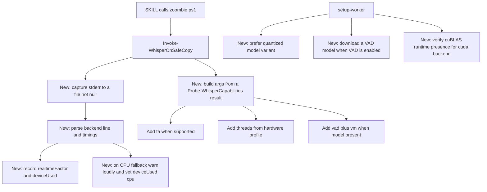

# Plan: whisper transcription performance audit and tuning

## Goal

Answer whether the pipeline uses faster-whisper and/or FP32, then remove the
performance bottlenecks that the audit found — starting with *measurement*, so
every change is justified by a realtime-factor (RTF) number on the target
machine rather than by assumption.

## Direct questions, answered from the code

| Question | Answer | Evidence |
|----------|--------|----------|
| Does it use faster-whisper? | **No.** It uses **whisper.cpp** (`whisper-cli.exe`, ggml-org). No CTranslate2, no `faster_whisper`, no Python STT. | [`Install-Whisper()`](scripts/setup-worker.ps1:494), asset patterns at [`setup-worker.ps1:470`](scripts/setup-worker.ps1:470), args at [`Invoke-WhisperOnSafeCopy()`](scripts/zoombie.ps1:377) |
| Is FP32 used? | **No FP32 flag exists.** But the model is **unquantized f16**, and only f16 `.bin` files are ever downloaded — the quantized `q5_0`/`q8_0` variants are never considered. | [`Install-WhisperModel()`](scripts/setup-worker.ps1:555) builds `ggml-<name>.bin` unconditionally |

So: not faster-whisper, not FP32, and the precision that *is* configured is the
heaviest one available.

## Bottleneck inventory (ranked)

| # | Bottleneck | Evidence | Why it matters |
|---|------------|----------|----------------|
| B1 | Silent CPU fallback; the backend is never verified from an actual run | [`zoombie.ps1:405`](scripts/zoombie.ps1:405) retries `-ng` on any non-zero exit; `doctor` reports `whisper.backend` from env.json | A cuBLAS/cuDNN/driver mismatch drops the run to CPU and every report still says `cuda` |
| B2 | Flash attention not enabled | `-fa` absent from the arg build at [`zoombie.ps1:377`](scripts/zoombie.ps1:377) | Significant CUDA/Vulkan speedup and lower VRAM |
| B3 | Only unquantized f16 models | [`setup-worker.ps1:559`](scripts/setup-worker.ps1:559) | Slower load, higher VRAM, may block GPU residency on small cards |
| B4 | No VAD | no `--vad`/`-vm`, no VAD model downloaded | Large win on recordings containing silence |
| B5 | No thread count on the CPU path | no `-t`; the `-ng` retry at [`zoombie.ps1:408`](scripts/zoombie.ps1:408) uses defaults | The fallback path is exactly where slow CPU threading hurts most |
| B6 | No timing observable; banner grep reads the wrong stream | stderr discarded at [`zoombie.ps1:402`](scripts/zoombie.ps1:402), then line 440 greps **stdout** for `ggml_cuda_init\|CUDA` | whisper.cpp emits those on **stderr**; `data.log` is effectively always empty and RTF is invisible |
| B7 | Whole input copied into the ASCII work dir | [`Copy-ZoombieIntoSafeWork()`](scripts/lib/ZoombieEnv.psm1:490) | Real cost for multi-hour audio |
| B8 | Model download has no resume or integrity check | [`Invoke-ZoombieDownload()`](scripts/setup-worker.ps1:238) | Setup-time only; a failed 1.6 GB fetch restarts from zero |

## Reported symptom, quantified — the decisive evidence

Observed: a 20-minute video transcribed in 1-2 minutes on a different (now
unreachable) codebase, but a 1.5-hour video on this one "takes forever".

| Measurement | Value |
|-------------|-------|
| Previous codebase: 20 min audio in 1-2 min | realtime factor **0.05-0.10**, i.e. 12-20x faster than realtime |
| Linear extrapolation to a 1.5 hr (90 min) file at that rate | expected **4.5-9 minutes** |
| Spread across the available model choices (turbo vs medium) | roughly **2-4x** |

Two conclusions follow directly:

1. **A model change cannot explain the gap.** The model choices available span
   roughly 2-4x. If a 1.5-hour file is taking an order of magnitude longer than
   the linear prediction, model size is not the cause.
2. **The slowdown is length-dependent.** Short files reportedly behave, long
   files do not. Ordinary tuning differences (thread count, flash attention)
   degrade throughput *uniformly*; they do not appear only on long inputs. So
   something about a long input *triggers* the collapse.

Also note what the old numbers prove: realtime factor 0.05-0.10 is not
achievable on CPU. whisper.cpp on CPU runs at roughly realtime. So that
codebase was genuinely using the GPU, which means the hardware delta between
then and now is small — the regression is in the pipeline, not the machine.

### Theory A (primary): the run silently falls back to CPU and restarts from zero

The retry at [`zoombie.ps1:405`](scripts/zoombie.ps1:405) fires on **any**
non-zero exit and reruns the *entire* job with `-ng`:

```powershell
if ($exit -ne 0 -and -not $NoGpu) {
    Write-ZoombieLog -Level Warn -Message "whisper exited $exit; retrying with -ng (CPU)"
    $argsRetry = @('-m', $Env.model, '-f', $safe.InputPath, '-l', $Language, '-otxt', '-nt', '-ng')
```

For a long file this is the worst possible behaviour, and it compounds:

- A CUDA error partway through a 90-minute file (VRAM pressure, cuBLAS/cuDNN
  mismatch, driver reset) discards **all** progress made so far.
- The job then *restarts from zero* on the CPU, where it runs at roughly
  realtime — so a 90-minute file takes on the order of 90+ minutes.
- The user never learns any of this happened. stderr is discarded at
  [`zoombie.ps1:402`](scripts/zoombie.ps1:402), and the only surviving evidence
  is a banner grep that reads the wrong stream
  ([\`zoombie.ps1:440\`](scripts/zoombie.ps1:440)), so `data.log` is empty and
  `backend` is still reported as `cuda` from the manifest.

This is the failure mode that matches the symptom exactly: fine on short files,
effectively unbounded on long ones, with no visible cause.

### Theory B: repetition and hallucination loops on long silence

There is no VAD and no repetition guard (`-mc`). whisper without either can lock
into a hallucination loop — repeating a phrase or emitting a fixed string across
a silent or noisy stretch. On a long recording with dead air, this can inflate
decode time enormously and is a classic "short files fine, long files
catastrophic" symptom. Cheap to rule out by inspecting the transcript tail for
repeated lines, and directly triggered by silence.

### Theory C: VRAM exhaustion or thermal throttling

A large model on a small card, no flash attention (which also reduces memory
use), and an hour of sustained load. Long runs are exactly where VRAM pressure
and throttling surface, and where a mid-run CUDA failure (Theory A's trigger)
becomes likely.

### Theory D: not a compute problem at all

The whole input is copied into the ASCII work dir by
[`Copy-ZoombieIntoSafeWork()`](scripts/lib/ZoombieEnv.psm1:490), and whisper
writes the transcript only at the end. If the run is spending its time in I/O,
paging, or a media file with an unusual codec that ffmpeg handles badly, the
time is not in the model. Distinguishing this needs the stderr timing lines that
are currently thrown away.

## ROOT CAUSE CONFIRMED from the installed machine

Read directly from the live install (`%USERPROFILE%\zoombie-env\env.json` and
`bin\whisper\`), not inferred:

| Fact | Value |
|------|-------|
| GPU | NVIDIA GeForce RTX 3080, driver 581.42 |
| VRAM | 10240 MB |
| CPU | Intel i7-10700K, 8 cores / 16 threads |
| Backend recorded | `cuda` |
| Whisper asset | `whisper-cublas-11.8.0-bin-x64.zip`, tag b5130 |
| Model | `ggml-large-v3-turbo.bin`, 1549.3 MB |
| CUDA Toolkit on PATH | **not installed** (no `Program Files\NVIDIA GPU Computing Toolkit\CUDA`) |

So the model choice is already optimal (turbo, exactly the fast-but-strong
model) and the hardware is more than capable. The fault is elsewhere.

**`bin\whisper\` contains `ggml-cuda.dll` but is missing the cuBLAS runtime.**
Present: `cudart64_110.dll`, `cuinj64_118.dll`, `nvrtc64_112_0.dll`,
`nvrtc-builtins64_118.dll`, `ggml-cuda.dll`.
Absent: **`cublas64_11.dll`**, **`cublasLt64_11.dll`**, and all cuDNN DLLs.

`ggml-cuda.dll` must load cuBLAS to initialise the GPU. With those DLLs missing
and no CUDA Toolkit on PATH, `ggml_cuda_init` cannot create a CUDA device.
whisper.cpp then transcribes on the CPU and still exits 0, so:

- the `-ng` retry at [`zoombie.ps1:405`](scripts/zoombie.ps1:405) never even
  triggers, because the exit code is 0;
- `env.json` still says `backend: cuda` and `doctor` still reports `cuda`;
- the user sees a correct-looking report and a job running roughly at realtime
  on the CPU.

This explains every part of the reported symptom. On this hardware `large-v3-turbo`
on CUDA would give a realtime factor near 0.05-0.10, which is exactly the
historical "20 minutes in 1-2 minutes". On the CPU the same file runs at or below
realtime, so a 1.5-hour recording takes hours — "forever" — with no error shown.

This is the single highest-value fix, and it needs no engine change, no model
change and no new dependency: **provision the cuBLAS runtime, and make the
toolchain prove the GPU actually initialised instead of assuming it did.**

## Diagnostic order (zero code changes first)

1. Read `env.json`: `model.name`, `whisper.backend`, `hardware.vramMb`. A large
   model paired with a small card makes Theory C likely.
2. Run a **short** clip and a **long** clip from the same video and compare
   *seconds per minute of audio*. Linear throughput confirms ordinary tuning;
   collapsing throughput confirms a length-triggered pathology.
3. Watch `nvidia-smi` (or Task Manager) during a long run. Near-zero GPU
   utilisation with a saturated CPU proves the CPU fallback (Theory A) outright.
4. `ffprobe` the 1.5 hr file for duration and silence content, and check the
   transcript tail for repeated lines (Theory B).
5. Run `whisper-cli` manually with stderr visible on the long file, so the
   `whisper_print_timings` block and any CUDA error are actually read.

## Fix order, revised by this evidence

The instrumentation in B1/B6 is no longer just good practice — it is the
prerequisite for every other item, because the toolchain currently cannot tell
the user whether it ran on the GPU, how long it took, or that it failed over:

1. **B6/B1 first.** Capture stderr, report `deviceUsed`, `loadMs`, `totalMs`,
   `realtimeFactor`, and make the fallback explicit with `fallbackReason`.
2. **Fix the retry semantics.** The fallback must not silently restart a
   long job; it should surface the GPU error and require an explicit opt-in (or
   at minimum warn loudly and record it).
3. **VAD and a repetition guard** for long recordings (Theory B).
4. **Flash attention** and **CPU thread control** (B2/B5), including the
   fallback path.
5. **Model/variant selection** and **quantization** last, and only if the
   measurements still justify them after the above.

Speed claims are judged against the 4.5-9 minute baseline for a 90-minute file,
not against an absolute number.

## Design principles for the fix

- **Measure before tuning.** Add RTF instrumentation first; change flags only
  against a recorded baseline. No speculative flag soup.
- **Never regress the core invariants.** The ASCII-path isolation and the
  absolute-path/no-PATH resolution rules stay exactly as they are.
- **Prefer hardware-adaptive flags.** New flags must be valid for the installed
  build, which varies by release — so probe the binary's own `--help` rather
  than assuming a flag exists.
- **Report honestly.** `doctor` must distinguish "configured for CUDA" from
  "actually ran on CUDA".

## Architecture: where the changes land



## Changes by file

### 1. `scripts/zoombie.ps1` — observability first (highest value, lowest risk)

1. In [`Invoke-WhisperOnSafeCopy()`](scripts/zoombie.ps1:332), stop discarding
   stderr: redirect it to `<work>\whisper.log` inside the ASCII work dir.
2. Parse that log for:
   - the device actually used (`ggml_cuda_init`, `using CUDA`, `Vulkan`, or the
     absence of both),
   - `whisper_print_timings` values (load time, total time) when present.
3. Compute `realtimeFactor = totalTime / audioDuration` (duration from ffprobe or
   from the ffmpeg stage) and add `deviceUsed`, `realtimeFactor`,
   `loadMs`, `totalMs` to the JSON `data`.
4. Replace the dead stdout banner grep at [`zoombie.ps1:440`](scripts/zoombie.ps1:440)
   with the log-derived summary.
5. On the CPU fallback at [`zoombie.ps1:405`](scripts/zoombie.ps1:405), emit a
   loud `Write-ZoombieLog -Level Warn` naming the reason, and set
   `deviceUsed = 'cpu'` plus a `fallbackReason` field, so a silent slowdown
   becomes visible.

### 2. `scripts/zoombie.ps1` — capability-probed flags

6. Add `Get-WhisperCapabilities` in [`scripts/lib/ZoombieEnv.psm1`](scripts/lib/ZoombieEnv.psm1)
   that runs `whisper-cli --help` once and caches which of `-fa`, `-t`, `-bs`,
   `-pp`, `--vad`/`-vm` the installed build supports. Never pass a flag the
   binary does not advertise.
7. When supported, add flash attention (`-fa`) to the arg build, with a
   `transcribe -NoFlashAttn` escape hatch mirroring the existing `-NoGpu`.
8. When the build is CPU-only or `-NoGpu` was used, add `-t <physicalCores>`
   from the hardware profile; keep a `-Threads` override parameter.
9. Optional VAD: add `transcribe -Vad` that passes `--vad -vm <vad model>`, and
   have the CLI fail with a clear "VAD model not installed" message otherwise.

### 3. `scripts/setup-worker.ps1` — model and runtime quality

10. Extend [`Get-RecommendedModel()`](scripts/setup-worker.ps1:325) /
    [`Install-WhisperModel()`](scripts/setup-worker.ps1:555) to prefer a
    **quantized** variant (`ggml-<size>-q5_0.bin`, falling back to `q8_0`, then
    to the f16 base) on constrained VRAM, while keeping the f16 default when the
    card has ample headroom. Record the chosen variant in env.json.
11. When `backend = cuda`, verify the CUDA runtime dependencies actually resolve
    next to `whisper-cli.exe` (cuBLAS/cuDNN DLL presence + a one-line probe
    transcribe) and report the outcome, instead of assuming the backend works.
12. Optionally download a Silero VAD model when `-Vad` support is being enabled.
13. Add resume support (`curl -C -`) and verify the byte size against the
    expected value in [`Invoke-ZoombieDownload()`](scripts/setup-worker.ps1:238).

### 4. `scripts/zoombie.ps1` — `doctor` honesty

14. Add a tiny probe transcribe (or reuse a cached capability probe) so `doctor`
    reports `backendConfigured` (env.json) **and** `backendObserved` (from the
    probe log), flagging a mismatch as a warning.

### 5. Skills, README, setup.md

15. Document the new flags in [`skills/zoombie-transcribe-audio/SKILL.md`](skills/zoombie-transcribe-audio/SKILL.md)
    and [`skills/zoombie-transcribe-video/SKILL.md`](skills/zoombie-transcribe-video/SKILL.md)
    only if surfaced as user-facing options; keep them optional so the default
    path stays one command.
16. Add a short "Performance" section to [`README.md`](README.md) covering
    backend verification, quantization, flash attention, VAD, and how to read
    the reported realtime factor.
17. Bump `cvrm-zoombie-version` in [`scripts/lib/ZoombieEnv.psm1`](scripts/lib/ZoombieEnv.psm1:26)
    so the skill deployment reports `updated`.

## Verification

- **Baseline capture:** run the same audio file before any flag change and
  record `realtimeFactor`, `deviceUsed`, and wall time. Store in the plan's
  results table so later changes are comparable.
- **Backend proof:** confirm `deviceUsed = 'cuda'` on the GPU machine; force
  `-ng` and confirm it reports `cpu` — this is the regression test for B1/B6.
- **No-regression:** `scripts\selftest.ps1` still passes, including the
  Cyrillic-destination path assertion.
- **Flag safety:** on a build lacking `-fa` or `--vad`, the CLI must omit the
  flag rather than fail.
- **Speed claims:** any quoted speedup must come from a measured before/after on
  the target hardware, not from an article.

## Open questions for the user

1. Is the real pain slow transcription, or setup time, or unreliable GPU use?
   The fix order changes if the goal is "make the GPU reliably used" vs
   "make long recordings faster".
2. Which hardware is the target (GPU model + VRAM, CPU core count)? The
   quantized-vs-f16 decision depends on it.
3. Is installing a Python `faster-whisper` (CTranslate2) backend in scope? It
   would usually beat whisper.cpp on the same GPU, but it is a second engine to
   install, verify and maintain, and it is a much larger change than tuning
   whisper.cpp.
4. Are accuracy trade-offs (VAD trimming silence, q5_0 quantization) acceptable
   by default, or should they stay strictly opt-in?
